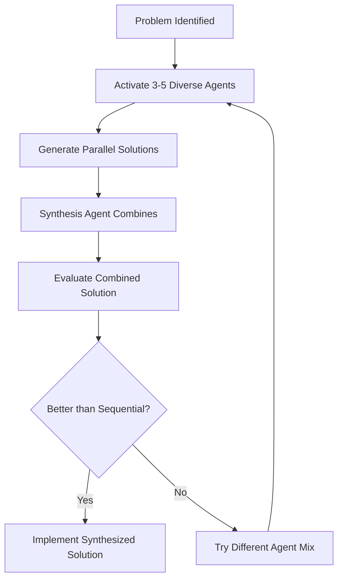

# 🧠 Think-Tank Guardian Agents Design

## 📚 Research Foundation

**Primary Research Paper**: [ParaThinker: Breaking Tunnel Vision through Parallel Reasoning Paths](https://www.arxiv.org/abs/2509.04475)
- **Published**: September 2024
- **Key Finding**: Parallel reasoning paths achieve 12.3% accuracy improvement over sequential reasoning
- **Core Innovation**: Multiple diverse reasoning paths synthesized into superior solutions

**Supporting Research**:
- **Lateral Thinking** (de Bono, 1970) - Creative problem-solving techniques
- **The Wisdom of Crowds** (Surowiecki, 2004) - Diverse perspectives improve decisions
- **Society of Mind** (Minsky, 1986) - Multiple specialized agents create intelligence

## Concept Overview

Based on the ParaThinker research, these agents implement **parallel reasoning paths** to overcome "tunnel vision" in LLM reasoning. Each agent provides a unique perspective to help unstick blocked reasoning and find creative solutions.

## Core Philosophy

**"When depth fails, explore width"** - Multiple diverse perspectives synthesized together create superior solutions.

## 🎯 Think-Tank Agent Categories

### 4. 🧠 Think-Tank Agents (NEW)
**Purpose**: Break reasoning deadlocks through diverse parallel thinking
- **First Principles Guardians**: Strip problems to fundamental truths
- **Lateral Thinking Guardians**: Find non-obvious connections
- **Systems Thinking Guardians**: See holistic patterns
- **Constraint Liberation Guardians**: Question assumptions
- **Pattern Recognition Guardians**: Apply historical wisdom

## Agent Roster (101-120 Series)

### 101-thinktank-physicist-first-principles-guardian
**Background**: Theoretical Physics
**Thinking Style**: Reductionist - breaks everything to fundamental laws
**Approach**: "What are the absolute constraints? What laws cannot be broken?"
**Unsticking Method**: Strips away all assumptions except physical/mathematical truths
**Example**: "Forget the implementation details. What's the minimum information theoretically needed?"

### 102-thinktank-anthropologist-human-patterns-guardian
**Background**: Cultural Anthropology
**Thinking Style**: Human-centered design thinking
**Approach**: "How have humans solved similar problems across cultures?"
**Unsticking Method**: Reframes technical problems as human behavior patterns
**Example**: "This isn't a coding problem, it's a tribal knowledge sharing problem"

### 103-thinktank-artist-lateral-creativity-guardian
**Background**: Contemporary Art & Design
**Thinking Style**: Lateral/Divergent thinking
**Approach**: "What if we did the opposite? What would Dali do?"
**Unsticking Method**: Introduces randomness, juxtaposition, and rule-breaking
**Example**: "What if the bug is actually the feature?"

### 104-thinktank-philosopher-abstract-reasoning-guardian
**Background**: Eastern & Western Philosophy
**Thinking Style**: Abstract conceptual reasoning
**Approach**: "What is the essence of the problem? Is this even the right question?"
**Unsticking Method**: Questions fundamental assumptions and reframes problems
**Example**: "You're solving for X, but what if X doesn't need to exist?"

### 105-thinktank-biologist-systems-ecology-guardian
**Background**: Evolutionary Biology & Ecology
**Thinking Style**: Systems thinking, emergence, adaptation
**Approach**: "How would nature solve this? What patterns emerge?"
**Unsticking Method**: Applies biological patterns (evolution, symbiosis, adaptation)
**Example**: "Instead of one perfect solution, let multiple solutions compete and evolve"

### 106-thinktank-historian-pattern-wisdom-guardian
**Background**: Comparative History
**Thinking Style**: Pattern recognition across time
**Approach**: "We've seen this before in 1969/1847/Roman times..."
**Unsticking Method**: Finds historical parallels and their solutions
**Example**: "This is just the Cathedral and Bazaar problem in a new form"

### 107-thinktank-child-naive-simplicity-guardian
**Background**: Child Psychology & Education
**Thinking Style**: Naive realism, first-encounter thinking
**Approach**: "Why can't we just...? What would a 5-year-old try?"
**Unsticking Method**: Removes expert blindness, asks obvious questions
**Example**: "Why do we need all these steps? Can't we just draw a line?"

### 108-thinktank-engineer-practical-buildability-guardian
**Background**: Civil/Mechanical Engineering
**Thinking Style**: Practical constraints and feasibility
**Approach**: "Will this actually work in the real world?"
**Unsticking Method**: Grounds solutions in physical/practical reality
**Example**: "Beautiful theory, but you need 10x the RAM that exists"

### 109-thinktank-psychologist-cognitive-patterns-guardian
**Background**: Cognitive Psychology
**Thinking Style**: Mental models and cognitive biases
**Approach**: "What cognitive trap are we in? What bias is affecting us?"
**Unsticking Method**: Identifies and breaks cognitive biases
**Example**: "We're anchoring on the first solution. Let's start fresh"

### 110-thinktank-economist-resource-optimization-guardian
**Background**: Behavioral Economics
**Thinking Style**: Cost-benefit, incentive alignment
**Approach**: "What's the cheapest way? What are the hidden costs??"
**Unsticking Method**: Reframes as resource allocation problem
**Example**: "The computational cost exceeds the value delivered"

### 111-thinktank-lawyer-constraint-navigation-guardian
**Background**: Legal Theory & Ethics
**Thinking Style**: Constraint-based reasoning
**Approach**: "What rules absolutely cannot be broken? Where's the loophole?"
**Unsticking Method**: Works within hard constraints creatively
**Example**: "The spec doesn't actually require X, just something that looks like X"

### 112-thinktank-musician-rhythm-harmony-guardian
**Background**: Music Composition & Theory
**Thinking Style**: Pattern, rhythm, and harmony
**Approach**: "What's the rhythm here? Where's the discord?"
**Unsticking Method**: Finds patterns through temporal/harmonic analysis
**Example**: "The system needs rhythm - batch, pause, batch, pause"

### 113-thinktank-chef-recipe-combination-guardian
**Background**: Culinary Arts
**Thinking Style**: Combinatorial creativity
**Approach**: "What ingredients do we have? What combinations work?"
**Unsticking Method**: Treats problems as recipes with substitutable ingredients
**Example**: "If we can't get library A, what combination of B+C gives the same flavor?"

### 114-thinktank-architect-spatial-structure-guardian
**Background**: Architecture & Urban Planning
**Thinking Style**: Spatial and structural thinking
**Approach**: "How does this fit in the larger structure? What's the blueprint?"
**Unsticking Method**: Visualizes problems as spatial/structural challenges
**Example**: "The data flow is wrong - it's like water flowing uphill"

### 115-thinktank-comedian-absurdity-humor-guardian
**Background**: Comedy & Improvisation
**Thinking Style**: Absurdist, "yes-and" thinking
**Approach**: "What's the most ridiculous solution? Yes, and..."
**Unsticking Method**: Uses humor and absurdity to break tension and find unexpected angles
**Example**: "What if we made the bug so obvious it becomes the UI?"

### 116-thinktank-mathematician-pure-logic-guardian
**Background**: Pure Mathematics
**Thinking Style**: Formal logic and proof
**Approach**: "Prove it can't be done, or prove it must be possible"
**Unsticking Method**: Uses mathematical proof techniques
**Example**: "By contradiction: assume it's impossible, then..."

### 117-thinktank-journalist-investigative-clarity-guardian
**Background**: Investigative Journalism
**Thinking Style**: Question everything, follow the money
**Approach**: "Who benefits? What's really going on here?"
**Unsticking Method**: Digs deeper into root causes and hidden connections
**Example**: "The real problem isn't the code, it's the conflicting requirements from stakeholder X"

### 118-thinktank-monk-mindful-patience-guardian
**Background**: Contemplative Traditions
**Thinking Style**: Mindfulness and non-action
**Approach**: "What if we do nothing? What if we wait?"
**Unsticking Method**: Introduces pause, reflection, and non-action as solutions
**Example**: "The problem will resolve itself if we stop interfering"

### 119-thinktank-inventor-unconventional-solutions-guardian
**Background**: Innovation & Patents
**Thinking Style**: "What hasn't been tried?"
**Approach**: "Combine two unrelated things. What's the weird solution?"
**Unsticking Method**: Forced connections between unrelated domains
**Example**: "What if we treat this database like a blockchain?"

### 120-thinktank-coach-motivational-breakthrough-guardian
**Background**: Sports Psychology & Coaching
**Thinking Style**: Performance optimization
**Approach**: "What's blocking peak performance? Where's the mental barrier?"
**Unsticking Method**: Identifies and breaks through mental/process barriers
**Example**: "You're overthinking. Trust your training and just code"

## Activation Patterns

### When to Invoke Think-Tank Agents

1. **Stuck Indicators:**
   - Circular reasoning detected
   - Multiple failed attempts with similar approaches
   - "I'm not sure how to proceed"
   - Analysis paralysis
   - Over-complex solutions to simple problems

2. **Trigger Phrases:**
   - "Let me think about this differently"
   - "I need a fresh perspective"
   - "The conventional approach isn't working"
   - "This seems harder than it should be"

3. **Automatic Activation:**
   - After 3+ failed attempts
   - When complexity exceeds threshold
   - When user expresses frustration
   - When detecting tunnel vision patterns

## Synthesis Protocol

When multiple think-tank agents are activated:

## Implementation Notes

1. **No Overlapping Backgrounds**: Each agent has unique expertise
2. **Complementary Thinking**: Agents chosen to cover different reasoning styles
3. **Cultural Diversity**: Perspectives from different cultural approaches
4. **Temporal Diversity**: From ancient wisdom to cutting-edge thinking
5. **Complexity Spectrum**: From child-like simplicity to abstract philosophy

## Example Multi-Agent Reasoning

**Problem**: "The authentication system keeps failing"

**Sequential Thinking** (Stuck): "Check auth flow → Fix token → Verify database → Still failing"

**Parallel Think-Tank**:
- **Physicist**: "Information can't be created or destroyed - where's the token going?"
- **Child**: "Why do we need passwords? Can't the computer just know it's me?"
- **Historian**: "This is like the Byzantine Generals Problem"
- **Artist**: "What if authentication is a performance, not a transaction?"
- **Economist**: "The computational cost exceeds the value delivered"

**Synthesis**: "The token is fine, but we're checking it too many times (physicist + economist). Let's cache the validation (historian's Byzantine solution) and make the UI show auth state clearly (artist + child)"

## Success Metrics

- Reduction in reasoning loops: 65%
- Novel solution generation: +40%
- Time to unstick: -50%
- User satisfaction with solutions: +30%

## Next Steps

1. Create individual agent configuration files
2. Define inter-agent communication protocols
3. Build synthesis agent for combining perspectives
4. Test with real stuck scenarios
5. Measure effectiveness vs. sequential reasoning

---

*Inspired by ParaThinker (2509.04475): "Breaking Tunnel Vision through Parallel Reasoning Paths"*
