# Agent Registry - Generic Guardian System

This document defines the specialized AI agents available for any software development project. Each agent has specific capabilities and responsibilities that can be applied across different domains and project types.

## Agent Overview Diagram

```mermaid
graph TB
    subgraph "📧 Data Processing Agents"
        A1[data-guardian]
        A2[file-guardian]
        A3[database-guardian]
    end
    
    subgraph "🔒 Quality & Security Agents"
        B1[security-guardian]
        B2[compliance-guardian]
        B3[code-guardian]
        B4[dependency-guardian]
    end
    
    subgraph "🧪 Development & Testing Agents"
        C1[test-guardian]
        C2[fix-guardian]
        C3[refactor-guardian]
        C4[ui-guardian]
    end
    
    subgraph "🏗️ Infrastructure Agents"
        D1[backup-guardian]
        D2[migration-guardian]
        D3[env-guardian]
        D4[process-guardian]
    end
    
    subgraph "⚡ Workflow Agents"
        E1[agile-guardian]
        E2[release-guardian]
        E3[git-guardian]
        E4[doc-guardian]
    end
    
    A1 --> B1
    A2 --> B2
    A3 --> D2
    B1 --> C1
    B2 --> E2
    C1 --> E1
    
    style A1 fill:#e1f5e1
    style B1 fill:#ffe1e1
    style D1 fill:#e1e8ff
```



## 📧 Data Processing Agents

### 1. data-guardian
**Purpose:** Validate data processing implementations across various formats and sources
**Capabilities:**
- Verify data format conversions (JSON, CSV, XML, etc.)
- Check data extraction and transformation methods
- Validate deduplication and cleaning strategies
- Ensure compliance with data processing standards

**Usage:**
```bash
# Invoked via Task tool with data-guardian agent type
```

### 2. file-guardian
**Purpose:** Handle and validate file operations across different formats and types
**Capabilities:**
- Ensure file format preservation during processing
- Extract metadata and content from various file types
- Verify cross-platform file compatibility
- Validate against file handling best practices

**Usage:**
```bash
# Invoked via Task tool with file-guardian agent type
```

### 3. database-guardian
**Purpose:** Optimize database queries and manage database operations across platforms
**Capabilities:**
- Query optimization for various database types
- Schema migration validation and review
- Performance tuning recommendations
- Data integrity and consistency verification

**Usage:**
```bash
# Invoked via Task tool with database-guardian agent type
```

## 🔒 Security & Compliance Agents

### 4. security-guardian
**Purpose:** Perform security audits and vulnerability assessments
**Capabilities:**
- Comprehensive security audits
- Authentication system validation
- Data leak detection
- OWASP compliance verification

### 5. compliance-guardian
**Purpose:** Verify regulatory compliance and prepare for audits
**Capabilities:**
- GDPR, HIPAA, SOC2 compliance checks
- Audit preparation
- Data handling practice verification
- Regulatory gap analysis

### 6. env-guardian
**Purpose:** Validate environment configurations and detect security issues
**Capabilities:**
- Exposed secrets detection
- Configuration validation
- Cross-environment consistency checks
- Deployment readiness verification

## 🧪 Development & Quality Agents

### 7. code-guardian
**Purpose:** Audit Python environment and code quality without modifications
**Capabilities:**
- Code formatting verification
- Linting issue detection
- Type safety checking
- Security vulnerability scanning

### 8. fix-guardian
**Purpose:** Automatically fix code formatting and linting issues
**Capabilities:**
- Automatic formatting with ruff
- Linting issue resolution
- Code style standardization
- Pre-commit preparation

### 9. refactor-guardian
**Purpose:** Analyze and improve code architecture
**Capabilities:**
- Code smell identification
- Technical debt reduction
- Dependency untangling
- Architecture improvement suggestions

### 10. test-guardian
**Purpose:** Generate boilerplate unit test files for Python code
**Capabilities:**
- Test scaffold creation
- Test structure generation
- Import management
- Placeholder test function creation

### 11. ui-guardian
**Purpose:** Automated UI testing and validation using Playwright
**Capabilities:**
- Cross-browser testing
- Visual regression testing
- User workflow validation
- Accessibility compliance checks

## 🏗️ Infrastructure Management Agents

### 12. backup-guardian
**Purpose:** Ensure disaster recovery readiness
**Capabilities:**
- Recovery drill execution
- Backup integrity validation
- RTO/RPO compliance verification
- Business continuity planning

### 13. migration-guardian
**Purpose:** Review and validate database migrations
**Capabilities:**
- Migration script safety review
- Rollback plan generation
- High-risk operation identification
- Schema synchronization

### 14. process-guardian
**Purpose:** Validate multi-service orchestration
**Capabilities:**
- Service startup/shutdown validation
- Port conflict detection
- Zombie process identification
- Orchestration pattern compliance

### 15. dependency-guardian
**Purpose:** Audit Python project dependencies
**Capabilities:**
- Security vulnerability scanning
- Outdated package detection
- Dependency health checks
- uv toolchain management

## ⚡ Workflow & Documentation Agents

### 16. agile-guardian
**Purpose:** Continuous oversight of development workflow
**Capabilities:**
- Task tracking synchronization
- Test coverage monitoring
- Documentation updates
- Follow-up task identification

### 17. release-guardian
**Purpose:** Manage versioned releases
**Capabilities:**
- Changelog generation
- Git tag creation
- Release process automation
- Version bump management

### 18. git-guardian
**Purpose:** Commit and push code with standardized messages
**Capabilities:**
- Conventional commit message generation
- Backup branch creation
- Safe push to main
- Change analysis

### 19. doc-guardian
**Purpose:** Analyze documentation changes
**Capabilities:**
- Version impact analysis
- Documentation consistency checks
- Change report generation
- Markdown validation

## Specialized Agents

### 20. cost-guardian
**Purpose:** Analyze and optimize cloud infrastructure costs
**Capabilities:**
- Cloud spending analysis
- Cost optimization recommendations
- Budget forecasting
- Wasteful spending identification

### 21. perf-guardian
**Purpose:** Analyze and optimize application performance
**Capabilities:**
- Performance bottleneck identification
- Memory leak detection
- Database query optimization
- I/O operation analysis

### 22. fastapi-guardian
**Purpose:** Validate FastAPI applications
**Capabilities:**
- Endpoint implementation verification
- Async pattern validation
- OpenAPI compliance checking
- Current standards validation

### 23. tui-guardian
**Purpose:** Validate terminal user interfaces
**Capabilities:**
- Keyboard navigation checking
- Component flow validation
- Accessibility compliance
- Framework best practices

### 24. uv-guardian
**Purpose:** Validate Python projects against uv standards
**Capabilities:**
- Virtual environment isolation enforcement
- Dependency management verification
- Command pattern validation
- Best practices compliance

### 25. entry-guardian
**Purpose:** Validate application entry points
**Capabilities:**
- Single-entry architecture verification
- Mode detection logic validation
- CLI/TUI switching pattern checks
- Interactive mode fallback validation

### 26. deno-guardian
**Purpose:** Validate Deno applications
**Capabilities:**
- Permission model auditing
- deno.json configuration verification
- Import map checking
- TypeScript/JSX pattern validation

### 27. deploy-guardian
**Purpose:** Manage software deployments
**Capabilities:**
- Deployment automation
- Rollback management
- Canary release handling
- Post-deployment monitoring

### 28. feedback-guardian
**Purpose:** Analyze and categorize user feedback
**Capabilities:**
- Support ticket processing
- Sentiment analysis
- Feature request prioritization
- Insight extraction

### 29. ops-guardian
**Purpose:** Monitor application health
**Capabilities:**
- Log analysis
- Performance metric tracking
- Production issue investigation
- System health reporting

### 30. astro-guardian
**Purpose:** Validate Astro framework projects
**Capabilities:**
- .astro file syntax checking
- Island architecture validation
- Static site optimization
- HMR setup verification

## Agent Configuration

### Environment Variables
```bash
# Agent configuration
export AGENT_LOG_LEVEL=INFO
export AGENT_TIMEOUT=300
export AGENT_RETRY_COUNT=3
export AGENT_PARALLEL_LIMIT=4
```

### Agent Priority Levels
1. **Critical:** backup-guardian, security-guardian, env-guardian
2. **High:** git-guardian, release-guardian, migration-guardian
3. **Medium:** code-guardian, fix-guardian, test-guardian
4. **Low:** doc-guardian, feedback-guardian

## Agent Development Guidelines

### Creating New Agents
1. Define clear single responsibility
2. Implement standard interfaces
3. Include comprehensive logging
4. Support rollback operations
5. Document all capabilities

### Agent Testing
```bash
# Test individual agent functionality
uv run pytest tests/agents/

# Test agent interactions
uv run pytest tests/integration/

# Test full pipeline
uv run pytest tests/e2e/
```

## Agent Monitoring

### Health Checks
```bash
# Check agent status
./citibank agent-status

# View agent logs
./citibank agent-logs --name=email-guardian

# Monitor performance
./citibank agent-metrics
```

### Performance Metrics
- Processing time per task
- Success/failure rates
- Resource utilization
- Error frequency

## Agent Error Handling

### Retry Strategy
```python
# Agent retry configuration
RETRY_CONFIG = {
    "max_attempts": 3,
    "backoff_multiplier": 2,
    "initial_delay": 1,
    "max_delay": 60
}
```

### Failure Recovery
1. Log detailed error context
2. Preserve partial progress
3. Notify relevant agents
4. Attempt automatic recovery
5. Escalate if recovery fails

---

**Document Version:** 2.0.0  
**Last Updated:** 2025-09-06  
**Repository:** https://github.com/anthropic/claude-guardian-agents