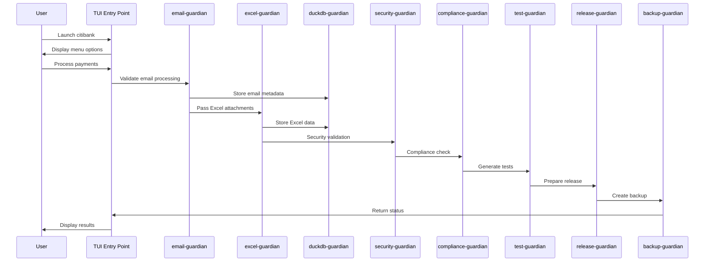
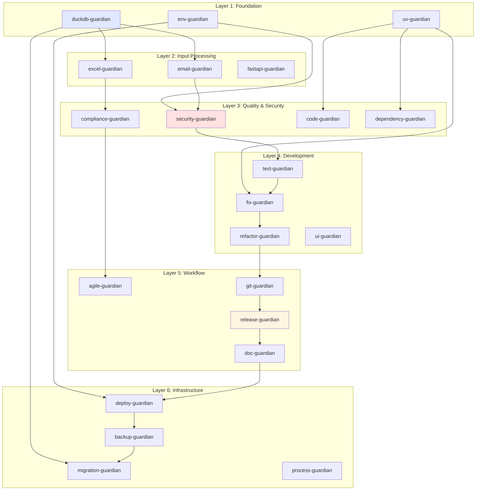
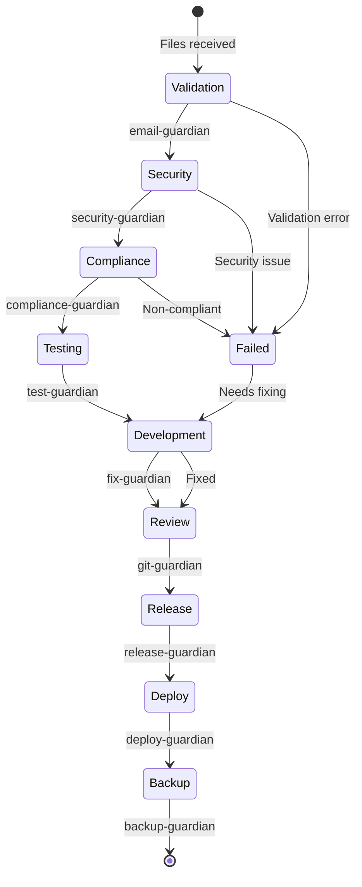

# Agent Relationships for Citibank Payment Processing

This document defines how agents interact and collaborate within the Citibank Payment Processing Workflow System.

## Agent Communication Flow



## Agent Dependency Graph



## Agent Interaction Patterns

### 1. Security & Compliance Chain
```
email-guardian → security-guardian → compliance-guardian → test-guardian
```
**Use Case:** Email processing with security and compliance validation
**Description:** Each agent validates its domain before passing to the next

### 2. Code Quality Pipeline
```
code-guardian → fix-guardian → refactor-guardian → git-guardian
```
**Use Case:** Code quality improvement workflow
**Description:** Sequential code improvement and version control

### 3. Database Migration Flow
```
duckdb-guardian → migration-guardian → backup-guardian → deploy-guardian
```
**Use Case:** Safe database schema changes
**Description:** Validated migrations with backup and deployment

### 4. Development Cycle
```
agile-guardian ⟷ test-guardian ⟷ ui-guardian
     ↑                    ↓
     └─── fix-guardian ───┘
```
**Use Case:** Iterative development with testing
**Description:** Continuous development oversight with quality checks

### 5. Release Management
```
doc-guardian → release-guardian → git-guardian → deploy-guardian
        ↓
    backup-guardian
```
**Use Case:** Coordinated release process
**Description:** Documentation, versioning, and deployment with backups

## Message Protocols

### Standard Message Format
```json
{
    "agent_id": "email-guardian",
    "timestamp": "2025-08-29T10:00:00Z",
    "message_type": "validation_complete",
    "payload": {
        "file_id": "uuid-123",
        "status": "success",
        "metadata": {
            "msg_files": 10,
            "eml_files": 5,
            "attachments": 15
        }
    },
    "next_agent": "security-guardian"
}
```

### Error Message Format
```json
{
    "agent_id": "excel-guardian",
    "timestamp": "2025-08-29T10:00:00Z",
    "message_type": "error",
    "error": {
        "code": "EXCEL_FORMULA_LOST",
        "message": "Power Query connection failed",
        "file_id": "uuid-456",
        "retry_count": 2
    },
    "escalate_to": "refactor-guardian"
}
```

## Agent Coordination Rules

### 1. Environment Management
- `uv-guardian` validates all Python environment operations
- `env-guardian` checks configuration security
- `process-guardian` manages service orchestration

### 2. Security First
- `security-guardian` must approve before production deployment
- `compliance-guardian` validates regulatory requirements
- `env-guardian` scans for exposed secrets

### 3. Quality Gates
- `code-guardian` audits before `fix-guardian` repairs
- `test-guardian` generates tests after code changes
- `ui-guardian` validates user interfaces before release

### 4. Infrastructure Safety
- `backup-guardian` creates snapshots before major changes
- `migration-guardian` reviews all database changes
- `deploy-guardian` manages staged rollouts

## Agent Communication Channels

### 1. Direct Communication
**Agents:** Sequential workflow agents
**Method:** Task tool invocation
**Example:** `email-guardian` → `security-guardian`

### 2. Audit Trail
**Agents:** All agents → `doc-guardian`
**Method:** Documentation updates
**Example:** Any agent → `doc-guardian`

### 3. Quality Feedback Loop
**Agents:** Development agents
**Method:** Iterative improvement
**Example:** `code-guardian` ↔ `fix-guardian` ↔ `refactor-guardian`

## Workflow State Machine



## Agent Priority Matrix

| Scenario | Priority Order |
|----------|---------------|
| Security Incident | security-guardian → env-guardian → backup-guardian |
| Code Quality | code-guardian → fix-guardian → refactor-guardian |
| Release Prep | test-guardian → doc-guardian → release-guardian |
| Deployment | migration-guardian → deploy-guardian → ops-guardian |
| Emergency Recovery | backup-guardian → migration-guardian → process-guardian |

## Performance Optimization

### 1. Agent Specialization
```python
AGENT_CAPABILITIES = {
    "security-guardian": ["audit", "vulnerability", "compliance"],
    "code-guardian": ["quality", "formatting", "linting"],
    "test-guardian": ["unit", "integration", "scaffold"],
    "backup-guardian": ["snapshot", "recovery", "disaster"]
}
```

### 2. Parallel Execution Groups
```python
PARALLEL_GROUPS = {
    "analysis": ["code-guardian", "dependency-guardian", "perf-guardian"],
    "validation": ["security-guardian", "compliance-guardian", "env-guardian"],
    "testing": ["test-guardian", "ui-guardian"],
    "infrastructure": ["backup-guardian", "migration-guardian", "process-guardian"]
}
```

### 3. Resource Allocation
```python
RESOURCE_LIMITS = {
    "opus_agents": ["refactor-guardian", "migration-guardian", "security-guardian"],
    "sonnet_agents": ["fix-guardian", "git-guardian", "release-guardian"],
    "high_memory": ["duckdb-guardian", "excel-guardian"],
    "long_running": ["ui-guardian", "perf-guardian", "ops-guardian"]
}
```

## Specialized Workflows

### Email Processing Workflow
```
email-guardian → excel-guardian → duckdb-guardian → compliance-guardian
```

### FastAPI Development
```
fastapi-guardian → test-guardian → ui-guardian → deploy-guardian
```

### TUI Development
```
tui-guardian → entry-guardian → test-guardian → ui-guardian
```

### Cost Optimization
```
cost-guardian → perf-guardian → ops-guardian → feedback-guardian
```

### Astro/Deno Projects
```
astro-guardian/deno-guardian → uv-guardian → deploy-guardian
```

## Monitoring and Metrics

### Key Performance Indicators
1. **Agent Response Time:** Time for agent task completion
2. **Success Rate:** Percentage of successful agent executions
3. **Error Recovery:** Time to recover from agent failures
4. **Throughput:** Tasks processed per hour

### Agent Health Metrics
```bash
# Check specific agent health
./citibank agent-health --name=security-guardian

# View agent interaction logs
./citibank agent-interactions --from=email-guardian --to=security-guardian

# Monitor workflow progress
./citibank workflow-status --id=payment-processing

# Get agent performance metrics
./citibank agent-metrics --timeframe=24h
```

---

**Document Version:** 2.0.0  
**Last Updated:** 2025-08-29  
**Repository:** https://github.com/kairin/citibank-payments