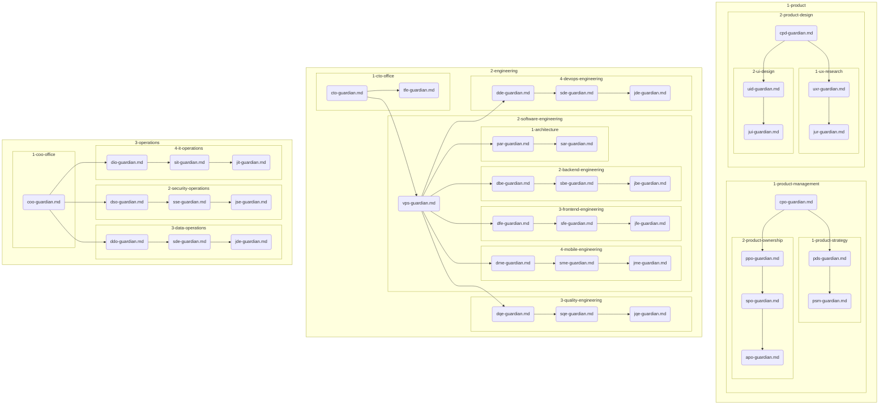

# AGENTS.md

This repository is structured to reflect a top-tier tech company. All agent profiles are located in the numbered directories, organized by their function and seniority.

## Agent Naming Convention

All agent profiles are named using the `[3-letter-short-form]-guardian.md` schema. For example, the Chief Product Officer agent is named `cpo-guardian.md`.

## Company Hierarchy

## How to Use

When you need to perform a task, first identify the appropriate agent by reviewing the folder structure and agent profiles. The directory structure reflects the hierarchy of a top-tier tech company, with senior roles in higher-level directories and junior roles in lower-level directories. Then, follow the instructions in the agent's profile to complete the task.
