# Complete Agent Naming Convention - Full Creative & Technical Lifecycle

## Updated Format with Expanded Design Teams

`{number}-{department}-{role}-{specialization}-guardian.md`

## Complete Process Flow Order

### 🎯 Strategic Planning Agents (001-010)
**Purpose**: Business strategy, requirements, and project planning
- `001-strategy-business-analysis-guardian.md` - Business requirements and feasibility
- `002-strategy-product-planning-guardian.md` - Product roadmap and feature planning  
- `003-strategy-market-research-guardian.md` - Market analysis and competitive research
- `004-strategy-stakeholder-management-guardian.md` - Stakeholder alignment and communication
- `005-strategy-resource-planning-guardian.md` - Budget, timeline, and resource allocation
- `006-strategy-user-research-guardian.md` - User personas, journeys, and requirements
- `007-strategy-competitive-analysis-guardian.md` - Competitor feature and design analysis
- `008-strategy-business-goals-guardian.md` - KPI definition and success metrics
- `009-strategy-risk-assessment-guardian.md` - Project risk identification and mitigation
- `010-strategy-project-charter-guardian.md` - Project scope and charter definition

### 🏗️ Technical Architecture Agents (011-020)
**Purpose**: System design and technical architecture planning
- `011-architecture-system-design-guardian.md` - Overall system architecture
- `012-architecture-database-design-guardian.md` - Data architecture and schema design
- `013-architecture-api-design-guardian.md` - API structure and integration planning
- `014-architecture-security-design-guardian.md` - Security architecture and threat modeling
- `015-architecture-infrastructure-design-guardian.md` - Infrastructure and deployment architecture
- `016-architecture-performance-design-guardian.md` - Performance and scalability planning
- `017-architecture-integration-design-guardian.md` - Third-party integration architecture
- `018-architecture-microservices-design-guardian.md` - Service decomposition and design
- `019-architecture-data-flow-design-guardian.md` - Data pipeline and flow architecture
- `020-architecture-cloud-design-guardian.md` - Cloud architecture and migration planning

### 🎨 Visual Design & Graphics Agents (021-035)
**Purpose**: Visual identity, graphics, and brand design
- `021-design-brand-identity-guardian.md` - Brand guidelines, logos, and visual identity
- `022-design-visual-design-guardian.md` - Color schemes, typography, and visual hierarchy
- `023-design-illustration-guardian.md` - Custom illustrations, icons, and graphics
- `024-design-photography-guardian.md` - Photography direction, editing, and asset management
- `025-design-iconography-guardian.md` - Icon design, icon systems, and visual symbols
- `026-design-print-design-guardian.md` - Print materials, marketing collateral, and layouts
- `027-design-presentation-design-guardian.md` - Slide decks, pitch materials, and presentations
- `028-design-infographic-design-guardian.md` - Data visualization and infographic design
- `029-design-packaging-design-guardian.md` - Product packaging and physical design
- `030-design-environmental-design-guardian.md` - Signage, spatial design, and environmental graphics
- `031-design-motion-graphics-guardian.md` - Animated graphics, transitions, and micro-interactions
- `032-design-video-production-guardian.md` - Video content, editing, and post-production
- `033-design-audio-design-guardian.md` - Sound design, music, and audio branding
- `034-design-3d-modeling-guardian.md` - 3D assets, modeling, and visualization
- `035-design-ar-vr-design-guardian.md` - Augmented and virtual reality design

### 💻 Interface & Experience Design Agents (036-050)
**Purpose**: User experience, interface design, and interaction design
- `036-ux-user-research-guardian.md` - User research, interviews, and behavioral analysis
- `037-ux-persona-development-guardian.md` - User personas, scenarios, and journey mapping
- `038-ux-information-architecture-guardian.md` - Site maps, navigation, and content structure
- `039-ux-wireframing-guardian.md` - Low-fidelity wireframes and layout planning
- `040-ux-prototyping-guardian.md` - Interactive prototypes and proof-of-concepts
- `041-ux-usability-testing-guardian.md` - User testing, feedback collection, and iteration
- `042-ui-interface-design-guardian.md` - High-fidelity interface design and layouts
- `043-ui-responsive-design-guardian.md` - Mobile-first and responsive design systems
- `044-ui-design-systems-guardian.md` - Component libraries, style guides, and patterns
- `045-ui-accessibility-design-guardian.md` - Inclusive design and accessibility compliance
- `046-interaction-design-guardian.md` - User flows, micro-interactions, and animations
- `047-mobile-app-design-guardian.md` - Native mobile app design and patterns
- `048-web-app-design-guardian.md` - Web application design and responsive layouts
- `049-dashboard-design-guardian.md` - Data dashboard and analytics interface design
- `050-conversational-design-guardian.md` - Chatbot, voice UI, and conversational interfaces

### ✍️ Content & Communication Design Agents (051-060)
**Purpose**: Content strategy, copywriting, and communication design
- `051-content-strategy-guardian.md` - Content planning, strategy, and governance
- `052-content-copywriting-guardian.md` - Website copy, marketing materials, and messaging
- `053-content-technical-writing-guardian.md` - Documentation, help guides, and technical content
- `054-content-social-media-guardian.md` - Social media content and community management
- `055-content-email-marketing-guardian.md` - Email campaigns, newsletters, and automation
- `056-content-seo-optimization-guardian.md` - SEO content optimization and search strategy
- `057-content-localization-guardian.md` - Multi-language content and cultural adaptation
- `058-content-accessibility-guardian.md` - Alt text, readable content, and accessible writing
- `059-content-legal-compliance-guardian.md` - Privacy policies, terms, and legal content
- `060-content-brand-voice-guardian.md` - Brand voice, tone, and messaging consistency

### 📧 Data Processing Agents (061-070)
**Purpose**: Data handling, validation, and transformation
- `061-data-processing-data-validation-guardian.md` - Cross-format data validation
- `062-data-processing-file-handling-guardian.md` - File operations and management  
- `063-data-processing-database-optimization-guardian.md` - Database query optimization
- `064-data-processing-etl-pipeline-guardian.md` - Extract, transform, load processes
- `065-data-processing-data-quality-guardian.md` - Data quality and integrity monitoring
- `066-data-processing-analytics-guardian.md` - Data analytics and reporting
- `067-data-processing-machine-learning-guardian.md` - ML model development and deployment
- `068-data-processing-data-visualization-guardian.md` - Charts, graphs, and data presentation
- `069-data-processing-real-time-streaming-guardian.md` - Real-time data processing
- `070-data-processing-data-governance-guardian.md` - Data privacy and governance

### 🧪 Development & Quality Agents (071-090)
**Purpose**: Code development, testing, and quality assurance
- `071-development-code-quality-guardian.md` - Code quality auditing
- `072-development-code-fixing-guardian.md` - Automated code fixing
- `073-development-refactoring-guardian.md` - Code refactoring and optimization
- `074-development-testing-unit-guardian.md` - Unit testing and test generation
- `075-development-testing-integration-guardian.md` - Integration testing
- `076-development-testing-ui-guardian.md` - UI and end-to-end testing
- `077-development-frontend-ui-guardian.md` - Frontend development and UI implementation
- `078-development-backend-api-guardian.md` - Backend API development
- `079-development-mobile-app-guardian.md` - Mobile application development
- `080-development-desktop-app-guardian.md` - Desktop application development
- `081-development-web-app-guardian.md` - Web application development
- `082-development-game-development-guardian.md` - Game development and interactive media
- `083-development-performance-optimization-guardian.md` - Performance tuning and optimization
- `084-development-documentation-code-guardian.md` - Technical documentation
- `085-development-review-code-guardian.md` - Code review and peer validation
- `086-development-debugging-guardian.md` - Bug investigation and resolution
- `087-development-integration-external-guardian.md` - External system integration
- `088-development-configuration-management-guardian.md` - Configuration and environment setup
- `089-development-automation-guardian.md` - Build automation and CI/CD setup
- `090-development-legacy-migration-guardian.md` - Legacy system migration and modernization

### 🔒 Security & Compliance Agents (091-100)  
**Purpose**: Security validation, compliance checking, and risk management
- `091-security-vulnerability-scanning-guardian.md` - Security vulnerability assessment
- `092-security-compliance-regulatory-guardian.md` - Regulatory compliance validation
- `093-security-environment-configuration-guardian.md` - Environment security configuration
- `094-security-dependency-audit-guardian.md` - Dependency security auditing
- `095-security-penetration-testing-guardian.md` - Security penetration testing
- `096-security-access-control-guardian.md` - Access control and authentication
- `097-security-data-protection-guardian.md` - Data encryption and protection
- `098-security-network-security-guardian.md` - Network security and firewall rules
- `099-security-incident-response-guardian.md` - Security incident handling
- `100-security-audit-compliance-guardian.md` - Security audit and compliance reporting

## Extended Visual Design Team Mapping

### 🎨 Visual & Graphics Teams (021-035)
**Brand Designers**: Visual identity, logos, brand guidelines
**Graphic Designers**: Marketing materials, illustrations, layouts  
**Motion Designers**: Animations, video graphics, transitions
**3D Artists**: 3D modeling, visualization, AR/VR assets
**Multimedia Specialists**: Video, audio, interactive media

### 💻 Interface & UX Teams (036-050)
**UX Researchers**: User research, testing, behavioral analysis
**Information Architects**: Site structure, navigation, content organization
**Interaction Designers**: User flows, micro-interactions, animations
**UI Designers**: Interface design, visual hierarchy, responsive layouts
**Accessibility Specialists**: Inclusive design, compliance, usability

### ✍️ Content & Communication Teams (051-060)
**Content Strategists**: Content planning, governance, optimization
**UX Writers**: Interface copy, micro-copy, user guidance
**Technical Writers**: Documentation, help content, API guides
**Brand Copywriters**: Marketing copy, brand voice, messaging
**Localization Specialists**: Multi-language, cultural adaptation

## Complete Creative-Technical Flow

```mermaid
flowchart TD
    subgraph "🎯 Strategy (001-010)"
        S1[001-business-analysis]
        S2[002-product-planning]
        S3[006-user-research]
    end
    
    subgraph "🏗️ Architecture (011-020)"
        A1[011-system-design]
        A2[012-database-design]
        A3[015-infrastructure-design]
    end
    
    subgraph "🎨 Visual Design (021-035)"
        V1[021-brand-identity]
        V2[022-visual-design]
        V3[023-illustration]
        V4[031-motion-graphics]
    end
    
    subgraph "💻 UX/UI Design (036-050)"
        U1[036-user-research]
        U2[039-wireframing]
        U3[042-interface-design]
        U4[046-interaction-design]
    end
    
    subgraph "✍️ Content (051-060)"
        C1[051-content-strategy]
        C2[052-copywriting]
        C3[058-accessibility]
    end
    
    subgraph "📧 Data (061-070)"
        D1[061-data-validation]
        D2[068-data-visualization]
    end
    
    subgraph "🧪 Development (071-090)"
        DEV1[077-frontend-ui]
        DEV2[078-backend-api]
        DEV3[076-testing-ui]
    end
    
    S1 --> S2 --> S3
    S3 --> A1
    A1 --> A2 --> A3
    S2 --> V1
    V1 --> V2 --> V3 --> V4
    S3 --> U1
    U1 --> U2 --> U3 --> U4
    V2 --> U3
    S2 --> C1
    C1 --> C2 --> C3
    A2 --> D1
    D1 --> D2
    U4 --> DEV1
    C2 --> DEV1
    A1 --> DEV2
    DEV1 --> DEV3
    
    style S1 fill:#e1f5e1
    style A1 fill:#f0f8ff
    style V1 fill:#ffe1f5
    style U1 fill:#fff4e1
    style C1 fill:#f5e1ff
    style D1 fill:#e1ffe1
    style DEV1 fill:#ffe1e1
```

## Key Benefits of Expanded Structure

### 1. **Complete Creative Pipeline**
- Brand development flows into visual design
- UX research informs interface design  
- Content strategy aligns with visual design
- All creative work feeds into development

### 2. **Proper Design Specialization**
- Distinct roles for different design disciplines
- Clear handoffs between design phases
- Specialized expertise for complex domains

### 3. **Content-Design Integration** 
- Content strategy happens early in process
- UX writing integrated with interface design
- Accessibility considered throughout
- Brand voice consistent across touchpoints

### 4. **Scalable Creative Operations**
- Room for 30+ design and content specialists
- Clear workflow between creative and technical teams
- Flexible structure for different project types

---

**This expanded structure ensures comprehensive coverage of all creative, design, and interface work that feeds into technical development.**