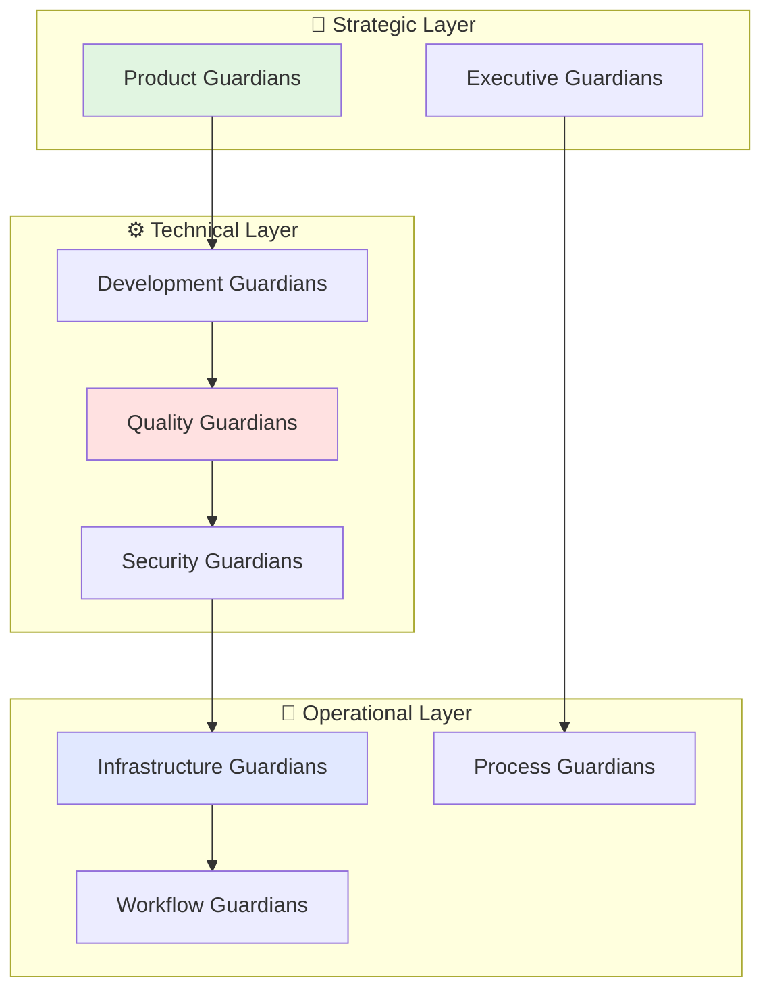
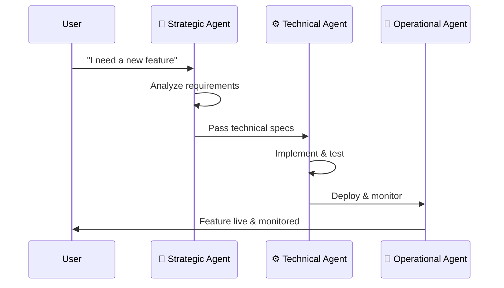

# Claude Guardian Agents

A comprehensive system of specialized AI agents designed to handle various aspects of software development, project management, and operations across any project type.

## 🎯 What Are Guardian Agents?

Guardian Agents are specialized Claude subagents, each with specific expertise and responsibilities. Think of them as your AI team members, each with their own role, tools, and workflows.

## 🏗️ System Architecture



## 📋 Quick Start Guide

### For Project Managers & Non-Developers
- 📖 [Visual Agent Overview](docs/visual-overview.md) - See what each agent does
- 🎯 [Use Case Examples](docs/use-cases.md) - Real-world scenarios
- 📊 [Agent Workflows](docs/workflows/) - Step-by-step process diagrams

### For Developers
- 🔧 [Technical Implementation](docs/technical/) - How agents work
- ⚙️ [Configuration Guide](docs/config/) - Setup instructions
- 🚀 [API Reference](docs/api/) - Integration details

## 🗂️ Agent Categories

### 1. 🎯 Strategic Agents
**Purpose**: High-level planning and product strategy
- **Product Guardians**: Market research, product strategy, roadmapping
- **Executive Guardians**: Business alignment, stakeholder management
- [📁 View All Strategic Agents](1-product/)

### 2. ⚙️ Technical Agents  
**Purpose**: Code development and technical excellence
- **Development Guardians**: Code writing, architecture, implementation
- **Quality Guardians**: Testing, code review, performance optimization
- **Security Guardians**: Security audits, vulnerability assessment
- [📁 View All Technical Agents](2-engineering/)

### 3. 🚀 Operational Agents
**Purpose**: Infrastructure, deployment, and process management  
- **Infrastructure Guardians**: Deployment, monitoring, scaling
- **Process Guardians**: Workflow automation, CI/CD, orchestration
- **Workflow Guardians**: Documentation, release management, compliance
- [📁 View All Operational Agents](3-operations/)

## 🔄 How Agents Work Together



## 📚 Documentation Structure

```
📁 docs/
├── 📄 visual-overview.md          # Non-developer friendly overview
├── 📄 use-cases.md               # Real-world examples
├── 📁 workflows/                 # Workflow diagrams for each agent
│   ├── 📄 product-workflow.md
│   ├── 📄 development-workflow.md
│   └── 📄 operations-workflow.md
├── 📁 technical/                 # Developer documentation
│   ├── 📄 architecture.md
│   ├── 📄 agent-communication.md
│   └── 📄 customization.md
└── 📁 config/                    # Configuration guides
    ├── 📄 setup.md
    ├── 📄 environment.md
    └── 📄 troubleshooting.md
```

## 🚀 Getting Started

### Step 1: Choose Your Entry Point
- **Non-Developer**: Start with [Visual Overview](docs/visual-overview.md)
- **Project Manager**: Check [Use Cases](docs/use-cases.md)
- **Developer**: Jump to [Technical Setup](docs/technical/setup.md)

### Step 2: Pick Your Agent
Browse agents by category or use our [Agent Finder](docs/agent-finder.md)

### Step 3: Follow the Workflow
Each agent has its own [workflow diagram](docs/workflows/) showing exactly how it works

## 📈 Version & Changes
- **Current Version**: 2.0.0
- [📋 View Changelog](CHANGELOG.md)
- [🔄 Version History](docs/versions/)

## 🤝 Contributing
- [📝 Adding New Agents](docs/contributing/new-agents.md)
- [🔧 Modifying Existing Agents](docs/contributing/modifications.md) 
- [📚 Documentation Guidelines](docs/contributing/documentation.md)

## 💡 Example Usage

```bash
# Ask a strategic agent for product planning
/task "Create a product roadmap" --agent product-strategy-guardian

# Get technical implementation from development agent
/task "Implement user authentication" --agent backend-guardian

# Deploy with operational agent
/task "Deploy to production" --agent deployment-guardian
```

## 🎯 Benefits

✅ **Modular**: Use only the agents you need  
✅ **Scalable**: Add new agents for new domains  
✅ **Clear**: Visual workflows for every process  
✅ **Generic**: Works with any project type  
✅ **Integrated**: Seamless agent-to-agent communication  

---

**Next Steps**: 
1. 📖 Read the [Visual Overview](docs/visual-overview.md)
2. 🔍 Find your first agent with [Agent Finder](docs/agent-finder.md)
3. 🚀 Follow a [workflow guide](docs/workflows/)

*Powered by Claude's advanced subagent system for specialized task delegation.*