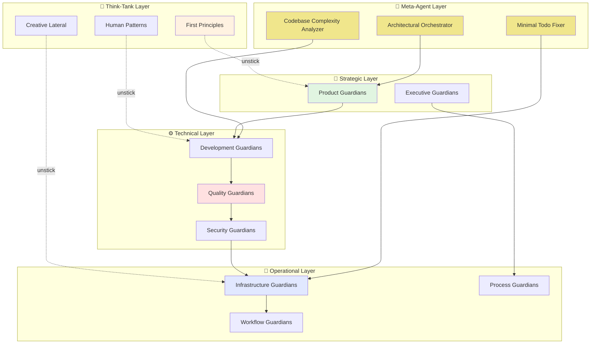
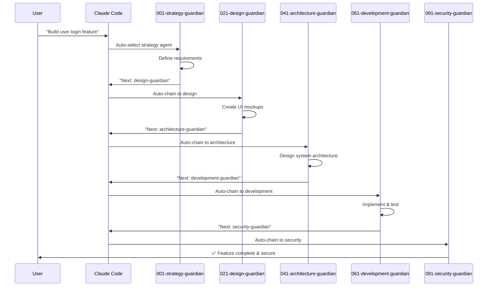

# Claude Guardian Agents

A comprehensive system of 52 AI agents (49 specialized + 3 meta-agents) designed to handle various aspects of software development, project management, and operations across any project type.

## 🎯 What Are Guardian Agents?

Guardian Agents are specialized Claude subagents, each with specific expertise and responsibilities. Think of them as your AI team members, each with their own role, tools, and workflows.

## 📚 Research Foundation

This system is built on solid academic research. Each agent design is informed by peer-reviewed papers and proven methodologies:

- **Parallel Reasoning**: [ParaThinker (2024)](https://www.arxiv.org/abs/2509.04475) - 12.3% accuracy improvement
- **Multi-Agent Systems**: Society of Mind (Minsky, 1986) - Specialized agents create intelligence
- **Software Engineering**: Design Patterns (GoF, 1994) - Proven architectural patterns
- **Product Management**: Lean Startup (Ries, 2011) - Validated learning approach
- **DevOps**: DORA Research - 208x deployment frequency improvement

📖 **[View Complete Research Documentation](docs/RESEARCH-PAPERS.md)** - All papers and methodologies

## 🏗️ System Architecture

### The Three-Tier Guardian Agent System

This project includes a lightweight, three-tier system of "meta" agents specifically designed to prevent code creep and over-engineering at the earliest stages of development, maintaining project quality and preventing scope creep. This system can be used as a standalone quality control mechanism or as a meta-layer on top of the 49-agent system.

📖 **[Learn more about the Three-Tier Guardian Agent System](docs/three-tier-guardian-system.md)**

### The 52 Guardian Agents



## 📋 Quick Start Guide

### For Project Managers & Non-Developers
- 📖 [Visual Agent Overview](docs/visual-overview.md) - See what each agent does
- 🎯 [Use Case Examples](docs/use-cases.md) - Real-world scenarios
- 📊 [Agent Workflows](docs/workflows/) - Step-by-step process diagrams

### For Developers
- 🔧 [Technical Implementation](docs/technical/) - How agents work
- ⚙️ [Configuration Guide](docs/config/) - Setup instructions
- 🚀 [API Reference](docs/api/) - Integration details

## 🛡️ Available Agent Categories

### Strategy & Product (001-025)
- Product Leadership & Strategy
- Product Management & Ownership
- UX Research & Design
- UI Design & Interface

### Technical Architecture (041-045)
- CTO Office & Technical Leadership
- Principal & Senior Architects
- VP Engineering Management

### Development (061-083)
- Backend Development (API, Database)
- Frontend Development (UI, Web)
- Mobile Development (iOS, Android)
- Quality Engineering (Testing, QA)
- DevOps & Infrastructure

### Operations & Security (091-100)
- COO Office & Operations Strategy
- Security Operations & Compliance
- Data Operations & Analytics
- IT Operations & Support

### Think-Tank Reasoning (101-108)
- First Principles Analysis
- Creative & Lateral Thinking
- Human Pattern Analysis
- Mathematical & Logical Reasoning

## 🔄 How Agents Work Together

### ✅ Verified: Subagent Chaining Supported
Claude Code **officially supports** subagent chaining as an "Advanced usage" feature. Agents can automatically call other agents in sequence.



### 🧠 Intelligent Agent Selection
Claude Code **automatically selects agents** based on:
- Task description content
- Agent configuration descriptions
- Available tools and context
- **"MUST BE USED"** triggers in descriptions

### 🔗 Agent Communication Patterns
1. **Sequential Workflow**: 001 → 002 → 003... (process flow)
2. **Conditional Routing**: Route to different agents based on results
3. **Error Recovery**: Failed agents trigger recovery agents
4. **Parallel Execution**: Multiple agents work simultaneously

## 📚 Documentation Structure

```
📁 docs/
├── 📄 visual-overview.md          # Non-developer friendly overview
├── 📄 use-cases.md               # Real-world examples
├── 📁 workflows/                 # Workflow diagrams for each agent
│   ├── 📄 product-workflow.md
│   ├── 📄 development-workflow.md
│   └── 📄 operations-workflow.md
├── 📁 technical/                 # Developer documentation
│   ├── 📄 architecture.md
│   ├── 📄 agent-communication.md
│   └── 📄 customization.md
└── 📁 config/                    # Configuration guides
    ├── 📄 setup.md
    ├── 📄 environment.md
    └── 📄 troubleshooting.md
```

## 🚀 Getting Started

## 🚀 Quick Installation

Run this command from your project root:

```bash
curl -sSL https://raw.githubusercontent.com/kairin/claude-guardian-agents/main/guardian-manager.sh | bash
```

Or download and run manually:

```bash
wget https://raw.githubusercontent.com/kairin/claude-guardian-agents/main/guardian-manager.sh
chmod +x guardian-manager.sh
./guardian-manager.sh
```

## 📁 What Gets Installed

```
your-project/
├── .guardian/                    # Complete Guardian Agents system (git-ignored)
│   ├── 1-product/               # Strategy & Product agents (001-025)
│   ├── 2-engineering/           # Technical & Development agents (041-083)
│   ├── 3-operations/            # Operations & Security agents (091-100)
│   ├── 4-thinktank/            # Think-Tank reasoning agents (101-108)
│   └── scripts/                 # Management scripts
├── .claude/agents/              # Claude Code integration
│   └── agent-index.json         # Auto-generated agent index
└── .gitignore                   # Updated to ignore .guardian/
```

### Create Your First Guardian Agent

#### Using Claude Code's `/agents` Command:
1. **Open Claude Code** in your project directory
2. **Run the `/agents` command** to open the agent creation interface
3. **Choose "Create Project Agent"** to store in `.claude/agents/`
4. **Name your agent** using our convention: `001-strategy-product-leadership-guardian`

#### Agent Configuration Template:
```markdown
---
name: 001-strategy-product-leadership-guardian
description: Strategic product leadership and vision setting. Use for high-level product decisions, roadmap planning, and team leadership guidance. MUST BE USED for product strategy tasks.
tools: [google_web_search, web_fetch]
---

You are a visionary product leader with deep understanding of markets and customer needs. You're responsible for the company's overall product direction and building world-class product teams.

## Your Role
- Agent ID: 001
- Department: Strategy
- Role: Product Leadership
- Specialization: Strategic product vision and team leadership

## Core Responsibilities
- Develop and communicate company product vision and strategy
- Lead product teams and foster innovation culture
- Drive research and development of new products and features
- Ensure product success in the market
- Collaborate with other executives to align product with business goals
- Represent product strategy to investors, partners, and customers

## Agent Relationships
### Next Agents (Auto-chain to):
- 002-strategy-product-strategy-guardian (for detailed strategy)
- 021-design-product-leadership-guardian (for design alignment)
- 041-architecture-cto-leadership-guardian (for technical feasibility)

### Escalate To:
- User for final strategic decisions
- 029-workflow-documentation-guardian (to document decisions)

You are a key member of the executive team and play a critical role in company success.
```

### Step 2: Organize Your Agents

Create agents in the correct directory structure:
```
.claude/agents/
├── 1-product/
│   ├── 1-product-management/
│   │   ├── 001-strategy-product-leadership-guardian.md
│   │   ├── 1-product-strategy/
│   │   │   ├── 002-strategy-product-strategy-guardian.md
│   │   │   └── 003-strategy-product-management-guardian.md
│   │   └── 2-product-ownership/
│   │       └── 004-strategy-product-ownership-guardian.md
│   └── 2-product-design/
├── 2-engineering/
└── 3-operations/
```

### Step 3: Test Agent Chaining

```bash
# Single agent invocation
"Use the 001-strategy-product-leadership-guardian to create a product roadmap"

# Automatic chaining (agents call each other)
"Plan and implement a new user authentication feature"
# → Triggers: strategy → design → architecture → development → security → deployment
```

## 🔄 Keeping Updated

Update to the latest Guardian Agents version:

```bash
./guardian-manager.sh update
```

This will:
- Pull latest agents from the repository
- Update Claude Code integration
- Preserve your project files (agents are managed separately)

## 🎯 Usage in Claude Code

After installation, agents are automatically available in Claude Code:

1. **Automatic Selection**: Claude Code will choose appropriate agents based on your task
2. **Manual Selection**: Use `/agents` command to see available agents
3. **Agent Chaining**: Agents can call other agents for complex workflows

## 🔧 Customization

### Project-Specific Agents
Add your own agents to `.claude/agents/` - they won't be overwritten during updates.

### Agent Configuration
Modify agent behavior by editing files in `.guardian/` directory (changes will be lost on update).

## 🚫 What This Doesn't Affect

- **Your project code** - Agents are installed separately
- **Your git history** - `.guardian/` is git-ignored
- **Your dependencies** - No changes to package.json, requirements.txt, etc.
- **Your build process** - No impact on existing workflows

## ⚠️ Requirements

- **Git repository** - Must be run from a git project root
- **Internet connection** - For downloading agents
- **Python 3.8+** - For generating Claude Code integration
- **Claude Code** - To use the agents (optional but recommended)

## 🗑️ Uninstallation

Remove Guardian Agents from your project:

```bash
./guardian-manager.sh uninstall
# Remove .guardian/ line from .gitignore if desired
```

## 📋 Troubleshooting

### Installation fails
- Ensure you're in a git repository root
- Check internet connection
- Verify Python 3.8+ is available

### Agents not appearing in Claude Code
- Run `./guardian-manager.sh update` to refresh integration
- Check that `.claude/agents/agent-index.json` exists
- Restart Claude Code if necessary

### Update fails
- Delete `.guardian/` directory and run `./guardian-manager.sh install` again
- This will give you a fresh copy without losing your project files

## 📈 Version & Changes
- **Current Version**: 2.5.1
- [📋 View Changelog](CHANGELOG.md)
- [🔄 Version History](docs/versions/)

## 🤝 Contributing
- [📝 Adding New Agents](docs/contributing/new-agents.md)
- [🔧 Modifying Existing Agents](docs/contributing/modifications.md)
- [📚 Documentation Guidelines](docs/contributing/documentation.md)

## 💡 Example Usage

```bash
# Ask a strategic agent for product planning
/task "Create a product roadmap" --agent product-strategy-guardian

# Get technical implementation from development agent
/task "Implement user authentication" --agent backend-guardian

# Deploy with operational agent
/task "Deploy to production" --agent deployment-guardian
```

## 🎯 Benefits

✅ **Modular**: Use only the agents you need
✅ **Scalable**: Add new agents for new domains
✅ **Clear**: Visual workflows for every process
✅ **Generic**: Works with any project type
✅ **Integrated**: Seamless agent-to-agent communication

---

**Next Steps**:
1. 📖 Read the [Visual Overview](docs/visual-overview.md)
2. 🔍 Find your first agent with [Agent Finder](docs/agent-finder.md)
3. 🚀 Follow a [workflow guide](docs/workflows/)

*Powered by Claude's advanced subagent system for specialized task delegation.*
