# Revised Agent Naming Convention - Complete Project Lifecycle

## Updated Format

`{number}-{department}-{role}-{specialization}-guardian.md`

## Complete Process Flow Order

### 🎯 Strategic Planning Agents (001-005)
**Purpose**: Business strategy, requirements, and project planning
- `001-strategy-business-analysis-guardian.md` - Business requirements and feasibility
- `002-strategy-product-planning-guardian.md` - Product roadmap and feature planning  
- `003-strategy-market-research-guardian.md` - Market analysis and competitive research
- `004-strategy-stakeholder-management-guardian.md` - Stakeholder alignment and communication
- `005-strategy-resource-planning-guardian.md` - Budget, timeline, and resource allocation

### 🏗️ Architecture & Design Agents (006-015)
**Purpose**: System design, technical architecture, and user experience planning
- `006-architecture-system-design-guardian.md` - Overall system architecture
- `007-architecture-database-design-guardian.md` - Data architecture and schema design
- `008-architecture-api-design-guardian.md` - API structure and integration planning
- `009-architecture-security-design-guardian.md` - Security architecture and threat modeling
- `010-architecture-infrastructure-design-guardian.md` - Infrastructure and deployment architecture
- `011-design-ux-research-guardian.md` - User experience research and analysis
- `012-design-ui-wireframe-guardian.md` - Interface design and wireframing
- `013-design-visual-design-guardian.md` - Visual design and branding
- `014-design-interaction-design-guardian.md` - User interaction and flow design
- `015-design-accessibility-design-guardian.md` - Accessibility and inclusive design

### 📧 Data Processing Agents (016-020)
**Purpose**: Data handling, validation, and transformation
- `016-data-processing-data-validation-guardian.md` - Cross-format data validation
- `017-data-processing-file-handling-guardian.md` - File operations and management  
- `018-data-processing-database-optimization-guardian.md` - Database query optimization
- `019-data-processing-etl-pipeline-guardian.md` - Extract, transform, load processes
- `020-data-processing-data-quality-guardian.md` - Data quality and integrity monitoring

### 🧪 Development & Quality Agents (021-035)
**Purpose**: Code development, testing, and quality assurance
- `021-development-code-quality-guardian.md` - Code quality auditing
- `022-development-code-fixing-guardian.md` - Automated code fixing
- `023-development-refactoring-guardian.md` - Code refactoring and optimization
- `024-development-testing-unit-guardian.md` - Unit testing and test generation
- `025-development-testing-integration-guardian.md` - Integration testing
- `026-development-testing-ui-guardian.md` - UI and end-to-end testing
- `027-development-frontend-ui-guardian.md` - Frontend development and UI
- `028-development-backend-api-guardian.md` - Backend API development
- `029-development-mobile-app-guardian.md` - Mobile application development
- `030-development-performance-optimization-guardian.md` - Performance tuning
- `031-development-documentation-code-guardian.md` - Technical documentation
- `032-development-review-code-guardian.md` - Code review and peer validation
- `033-development-debugging-guardian.md` - Bug investigation and resolution
- `034-development-integration-external-guardian.md` - External system integration
- `035-development-configuration-management-guardian.md` - Configuration and environment setup

### 🔒 Security & Compliance Agents (036-045)  
**Purpose**: Security validation, compliance checking, and risk management
- `036-security-vulnerability-scanning-guardian.md` - Security vulnerability assessment
- `037-security-compliance-regulatory-guardian.md` - Regulatory compliance validation
- `038-security-environment-configuration-guardian.md` - Environment security configuration
- `039-security-dependency-audit-guardian.md` - Dependency security auditing
- `040-security-penetration-testing-guardian.md` - Security penetration testing
- `041-security-access-control-guardian.md` - Access control and authentication
- `042-security-data-protection-guardian.md` - Data encryption and protection
- `043-security-network-security-guardian.md` - Network security and firewall rules
- `044-security-incident-response-guardian.md` - Security incident handling
- `045-security-audit-compliance-guardian.md` - Security audit and compliance reporting

### 🏗️ Infrastructure Agents (046-055)
**Purpose**: System deployment, operations, and infrastructure management
- `046-infrastructure-backup-recovery-guardian.md` - Backup and disaster recovery
- `047-infrastructure-migration-database-guardian.md` - Database migration management
- `048-infrastructure-deployment-orchestration-guardian.md` - Deployment automation
- `049-infrastructure-process-monitoring-guardian.md` - System monitoring and alerting
- `050-infrastructure-scaling-performance-guardian.md` - Auto-scaling and performance
- `051-infrastructure-container-orchestration-guardian.md` - Container management
- `052-infrastructure-cloud-management-guardian.md` - Cloud resource management  
- `053-infrastructure-network-configuration-guardian.md` - Network setup and optimization
- `054-infrastructure-logging-monitoring-guardian.md` - Centralized logging and metrics
- `055-infrastructure-disaster-recovery-guardian.md` - Business continuity planning

### ⚡ Workflow & Process Agents (056-065)
**Purpose**: Project management, process coordination, and continuous improvement
- `056-workflow-agile-development-guardian.md` - Agile process management
- `057-workflow-release-management-guardian.md` - Release planning and coordination
- `058-workflow-git-version-control-guardian.md` - Version control and branching
- `059-workflow-documentation-guardian.md` - Documentation management
- `060-workflow-feedback-support-guardian.md` - User feedback and support
- `061-workflow-quality-assurance-guardian.md` - QA process coordination
- `062-workflow-change-management-guardian.md` - Change request management
- `063-workflow-communication-guardian.md` - Team communication and updates
- `064-workflow-metrics-analytics-guardian.md` - Project metrics and analytics
- `065-workflow-continuous-improvement-guardian.md` - Process optimization

## Complete Project Lifecycle Flow

```mermaid
flowchart TD
    subgraph "🎯 Strategic Phase (001-005)"
        A1[001-business-analysis]
        A2[002-product-planning]  
        A3[003-market-research]
        A4[004-stakeholder-mgmt]
        A5[005-resource-planning]
    end
    
    subgraph "🏗️ Architecture Phase (006-015)"
        B1[006-system-design]
        B2[007-database-design]
        B3[008-api-design]
        B4[009-security-design]
        B5[010-infrastructure-design]
        B6[011-ux-research]
        B7[012-ui-wireframe]
        B8[013-visual-design]
    end
    
    subgraph "📧 Data Phase (016-020)"
        C1[016-data-validation]
        C2[017-file-handling]
        C3[018-db-optimization]
    end
    
    subgraph "🧪 Development Phase (021-035)"
        D1[021-code-quality]
        D2[022-code-fixing]
        D3[025-testing]
        D4[027-frontend]
        D5[028-backend]
    end
    
    subgraph "🔒 Security Phase (036-045)"
        E1[036-vulnerability-scan]
        E2[037-compliance]
        E3[038-env-security]
    end
    
    subgraph "🏗️ Infrastructure Phase (046-055)"
        F1[046-backup]
        F2[048-deployment]
        F3[049-monitoring]
    end
    
    subgraph "⚡ Workflow Phase (056-065)"
        G1[056-agile-mgmt]
        G2[057-release-mgmt]
        G3[059-documentation]
    end
    
    A1 --> A2 --> A3 --> A4 --> A5
    A5 --> B1
    B1 --> B2 --> B3 --> B4 --> B5
    B6 --> B7 --> B8
    B5 --> C1
    C1 --> C2 --> C3
    C3 --> D1
    D1 --> D2 --> D3 --> D4 --> D5
    D5 --> E1
    E1 --> E2 --> E3
    E3 --> F1
    F1 --> F2 --> F3
    F3 --> G1
    G1 --> G2 --> G3
    
    style A1 fill:#e1f5e1
    style B1 fill:#f0f8ff
    style C1 fill:#fff4e1
    style D1 fill:#ffe1e1
    style E1 fill:#ffebee
    style F1 fill:#e1e8ff
    style G1 fill:#f5f5f5
```

## Benefits of Complete Lifecycle Approach

### 1. **Proper Planning Phase**
- Business requirements are clearly defined
- Technical architecture is planned before coding
- Stakeholder alignment happens early

### 2. **Design Before Development**  
- UX research informs technical decisions
- System architecture guides implementation
- Security is designed in, not bolted on

### 3. **Logical Flow**
- Each phase builds on the previous
- Clear handoff points between teams
- Dependencies are explicit

### 4. **Scalable Structure**
- Room for 65+ specialized agents
- Clear categorization by phase
- Easy to add new specializations

## Team Mapping

### Strategic Teams (001-005)
- **Business Analysts**: Requirements and feasibility
- **Product Managers**: Feature planning and roadmaps
- **Market Researchers**: Competitive analysis
- **Project Managers**: Resource and timeline planning

### Architecture Teams (006-015)  
- **Solution Architects**: System design and technical strategy
- **Data Architects**: Database and data pipeline design
- **Security Architects**: Threat modeling and security design
- **UX Researchers**: User experience and interaction design
- **UI Designers**: Visual and interface design

### Development Teams (021-035)
- **Senior Developers**: Code quality and architecture
- **Full-stack Developers**: Frontend and backend implementation
- **QA Engineers**: Testing and quality assurance
- **DevOps Engineers**: Configuration and deployment setup

### Operations Teams (046-055)
- **Site Reliability Engineers**: Monitoring and scaling
- **Infrastructure Engineers**: Cloud and system management
- **Database Administrators**: Database operations
- **Security Operations**: Security monitoring and response

---

**This revised structure ensures all critical project phases are represented with appropriate specialization and clear workflow progression.**