# Guardian Agents Project Management System

## 🎯 Overview

A comprehensive tracking, documentation, and accountability system for managing outstanding implementations using spec-driven development principles.

## 📋 System Architecture

```mermaid
graph TB
    subgraph "📊 Tracking Layer"
        A[Feature Specifications]
        B[Implementation Plans]
        C[Progress Tracking]
        D[Validation Criteria]
    end

    subgraph "🔧 Execution Layer"
        E[Development Sprints]
        F[Code Implementation]
        G[Testing & Validation]
        H[Documentation Updates]
    end

    subgraph "✅ Accountability Layer"
        I[Automated Validation]
        J[Progress Reports]
        K[Stakeholder Reviews]
        L[Release Gates]
    end

    A --> E
    B --> F
    C --> G
    D --> H
    E --> I
    F --> J
    G --> K
    H --> L

    style A fill:#e1f5fe
    style I fill:#e8f5e8
    style L fill:#fff3e0
```



## 🏗️ Implementation Framework

### **1. Feature Specification System**

Each outstanding feature gets a comprehensive specification following this structure:

```
specs/features/
├── FEAT-001-intelligent-agent-orchestration/
│   ├── specification.md          # Detailed requirements
│   ├── acceptance-criteria.md    # Success definitions
│   ├── implementation-plan.md    # Technical approach
│   ├── validation-tests.md       # Testing strategy
│   └── progress-tracking.md      # Status updates
├── FEAT-002-living-code-intelligence/
└── ...
```

### **2. Multi-Level Tracking System**

#### **Level 1: Epic Tracking (High-Level Features)**
```yaml
epic_template:
  id: "EPIC-001"
  title: "Intelligent Agent Orchestration Engine"
  priority: "P1"
  business_value: "High"
  effort_estimate: "3-4 weeks"
  dependencies: []
  success_metrics:
    - "Automated agent selection accuracy > 90%"
    - "Task completion time reduced by 50%"
    - "User satisfaction score > 4.5/5"
```

#### **Level 2: Feature Tracking (Detailed Implementation)**
```yaml
feature_template:
  id: "FEAT-001"
  epic_id: "EPIC-001"
  title: "Context-Aware Agent Selection"
  status: "not_started"
  assignee: "TBD"
  sprint: "2025-Q1-S1"
  implementation_checklist:
    - [ ] Requirements analysis complete
    - [ ] Technical design approved
    - [ ] Core implementation finished
    - [ ] Unit tests passing
    - [ ] Integration tests passing
    - [ ] Documentation updated
    - [ ] Stakeholder review passed
```

#### **Level 3: Task Tracking (Granular Work Items)**
```yaml
task_template:
  id: "TASK-001"
  feature_id: "FEAT-001"
  title: "Implement project context analyzer"
  status: "in_progress"
  effort: "2 days"
  validation_criteria:
    - "Function correctly analyzes package.json"
    - "Detects project type with 95% accuracy"
    - "Generates context object in <100ms"
```

## 📁 Directory Structure

```
guardian-agents/
├── docs/
│   ├── PROJECT-MANAGEMENT-SYSTEM.md     # This file
│   ├── IMPLEMENTATION-ROADMAP.md        # Overall roadmap
│   └── progress-reports/                # Weekly/monthly reports
├── specs/
│   ├── features/                        # Feature specifications
│   │   ├── FEAT-001-intelligent-agent-orchestration/
│   │   ├── FEAT-002-living-code-intelligence/
│   │   └── ...
│   ├── epics/                          # High-level epic definitions
│   └── architecture/                   # System architecture specs
├── tracking/
│   ├── progress.json                   # Automated progress tracking
│   ├── metrics.json                    # Performance metrics
│   ├── validation-results/             # Test and validation outputs
│   └── reports/                        # Generated status reports
└── scripts/
    ├── track-progress.py              # Progress tracking automation
    ├── generate-reports.py            # Report generation
    ├── validate-implementation.py     # Validation automation
    └── update-status.py              # Status update automation
```

## 🔧 Tracking Tools and Automation

### **1. Progress Tracking Script**
```python
#!/usr/bin/env python3
# scripts/track-progress.py

import json
from datetime import datetime
from pathlib import Path

class ProgressTracker:
    def update_feature_status(self, feature_id: str, status: str, notes: str):
        """Update feature status with timestamp and notes"""
        pass

    def calculate_completion_percentage(self) -> dict:
        """Calculate overall and per-epic completion rates"""
        pass

    def generate_blockers_report(self) -> list:
        """Identify blocked tasks and their dependencies"""
        pass

    def validate_implementation(self, feature_id: str) -> dict:
        """Run automated tests and validation for a feature"""
        pass
```

### **2. Automated Validation Framework**
```yaml
# validation_config.yaml
validation_framework:
  code_quality:
    - lint_checks: "pylint, eslint, rustfmt"
    - test_coverage: ">= 80%"
    - security_scan: "bandit, semgrep"

  functionality:
    - unit_tests: "pytest, jest, cargo test"
    - integration_tests: "custom test suites"
    - performance_tests: "benchmark suites"

  documentation:
    - api_docs: "auto-generated and up-to-date"
    - user_guides: "reviewed and approved"
    - specs_updated: "specification matches implementation"
```

### **3. Report Generation System**
```python
# Automated report generation
class ReportGenerator:
    def generate_weekly_report(self) -> str:
        """Generate weekly progress report with charts and metrics"""
        pass

    def generate_milestone_report(self) -> str:
        """Generate comprehensive milestone completion report"""
        pass

    def generate_blockers_dashboard(self) -> str:
        """Generate real-time blockers and dependencies dashboard"""
        pass
```

## 📊 Tracking Templates

### **Epic Specification Template**
```markdown
# EPIC-001: Intelligent Agent Orchestration Engine

## 🎯 Business Objective
Transform manual agent selection into intelligent, context-aware orchestration

## 📋 Success Criteria
- [ ] 90% accuracy in agent selection
- [ ] 50% reduction in task completion time
- [ ] 4.5/5 user satisfaction score
- [ ] Integration with existing GPM system
- [ ] Backward compatibility maintained

## 🗓️ Timeline
- **Start Date**: 2025-01-15
- **Target Completion**: 2025-02-15
- **Current Status**: Not Started

## 💼 Business Value
- **High Impact**: Revolutionary improvement to user experience
- **Market Differentiation**: First truly intelligent agent ecosystem
- **Revenue Impact**: Estimated $5M+ in new opportunities

## 🔗 Dependencies
- [ ] Completion of GPM validation (BLOCKING)
- [ ] Agent metadata enrichment (DEPENDENCY)
- [ ] Claude Code integration testing (DEPENDENCY)

## 📈 Progress Tracking
- **Overall Completion**: 0%
- **Features Completed**: 0/5
- **Tests Passing**: 0/12
- **Documentation**: 0%

## 🚨 Current Blockers
None

## 📝 Notes
Initial epic creation - awaiting resource allocation
```

### **Feature Implementation Template**
```markdown
# FEAT-001: Context-Aware Agent Selection

## 🎯 Feature Description
Implement intelligent agent selection based on project context, task complexity, and historical performance

## ✅ Acceptance Criteria
- [ ] **AC-001**: System analyzes project structure and selects optimal agents
- [ ] **AC-002**: Selection accuracy >= 90% in testing scenarios
- [ ] **AC-003**: Response time < 500ms for agent selection
- [ ] **AC-004**: Graceful fallback to manual selection if automation fails
- [ ] **AC-005**: Comprehensive logging for decision auditing

## 🔧 Implementation Checklist
- [ ] **Requirements Analysis** (2 days)
  - [ ] Gather project context requirements
  - [ ] Define agent selection algorithms
  - [ ] Identify data sources and APIs
- [ ] **Technical Design** (3 days)
  - [ ] Design system architecture
  - [ ] Define APIs and interfaces
  - [ ] Create data models
- [ ] **Core Implementation** (8 days)
  - [ ] Project context analyzer
  - [ ] Agent capability matcher
  - [ ] Selection algorithm engine
  - [ ] Integration with GPM
- [ ] **Testing & Validation** (4 days)
  - [ ] Unit tests (>= 90% coverage)
  - [ ] Integration tests
  - [ ] Performance benchmarking
  - [ ] User acceptance testing
- [ ] **Documentation** (2 days)
  - [ ] API documentation
  - [ ] User guide updates
  - [ ] Architecture documentation

## 🧪 Test Cases
1. **TC-001**: Single agent selection for simple tasks
2. **TC-002**: Multi-agent orchestration for complex workflows
3. **TC-003**: Context adaptation for different project types
4. **TC-004**: Performance under high load
5. **TC-005**: Error handling and fallback scenarios

## 📊 Validation Metrics
- **Functional**: All acceptance criteria met
- **Performance**: Response time < 500ms (95th percentile)
- **Quality**: Code coverage >= 90%
- **Usability**: User task completion rate >= 95%

## 🗓️ Timeline
- **Start Date**: 2025-01-20
- **End Date**: 2025-02-10
- **Current Status**: Not Started
- **Estimated Effort**: 19 person-days

## 👥 Assignment
- **Primary Developer**: TBD
- **Reviewer**: TBD
- **Product Owner**: TBD

## 🚨 Risks & Mitigation
- **Risk**: Algorithm complexity may impact performance
  - **Mitigation**: Implement caching and optimization strategies
- **Risk**: Integration challenges with existing GPM system
  - **Mitigation**: Early integration testing and close coordination

## 📝 Progress Notes
_Updates will be added here as work progresses_
```

### **Task Tracking Template**
```yaml
# TASK-001: Implement Project Context Analyzer
task_id: "TASK-001"
feature_id: "FEAT-001"
title: "Implement project context analyzer component"
description: "Build component that analyzes project structure and extracts relevant context for agent selection"

status: "not_started"  # not_started, in_progress, blocked, review, done
priority: "high"
effort_estimate: "2 days"
actual_effort: null

assigned_to: null
reviewer: null
start_date: null
end_date: null
completion_date: null

# Detailed work breakdown
work_items:
  - id: "WI-001"
    description: "Analyze package.json for Node.js projects"
    status: "not_started"
    effort: "4 hours"

  - id: "WI-002"
    description: "Analyze requirements.txt for Python projects"
    status: "not_started"
    effort: "4 hours"

  - id: "WI-003"
    description: "Implement generic project structure analyzer"
    status: "not_started"
    effort: "8 hours"

# Success criteria
validation_criteria:
  - "Correctly identifies project type (Node.js, Python, Rust, etc.)"
  - "Extracts dependencies and their versions"
  - "Identifies existing code patterns and architectures"
  - "Generates context object in JSON format"
  - "Handles edge cases and malformed project files"

# Test requirements
test_requirements:
  - unit_tests: "Test each project type analyzer separately"
  - integration_tests: "Test with real project examples"
  - performance_tests: "Ensure analysis completes in <100ms"

# Documentation requirements
documentation:
  - api_docs: "Document public interfaces and return formats"
  - examples: "Provide example usage for each project type"
  - integration_guide: "How to integrate with agent selection system"

# Dependencies
dependencies:
  - "Access to project file system"
  - "JSON parsing utilities"
  - "File type detection libraries"

# Blockers
blockers: []

# Notes
notes: "Initial task definition - ready for assignment"
```

## 🔄 Automated Progress Tracking

### **1. Status Update Automation**
```python
#!/usr/bin/env python3
# scripts/update-status.py

class StatusUpdater:
    def scan_git_commits(self):
        """Automatically update task status based on git commits"""
        # Parse commit messages for task IDs
        # Update completion status
        # Calculate effort spent
        pass

    def validate_completion(self, task_id: str):
        """Validate that task is truly complete"""
        # Run automated tests
        # Check documentation updates
        # Verify acceptance criteria
        pass

    def update_progress_metrics(self):
        """Update overall progress metrics"""
        # Calculate completion percentages
        # Update timeline projections
        # Generate alerts for blockers
        pass
```

### **2. Dashboard Generation**
```html
<!-- Real-time progress dashboard -->
<div class="progress-dashboard">
    <div class="metrics-overview">
        <div class="metric">
            <h3>Overall Progress</h3>
            <div class="progress-bar" data-progress="23%"></div>
        </div>
        <div class="metric">
            <h3>Sprint Velocity</h3>
            <span class="velocity">12 points/week</span>
        </div>
    </div>

    <div class="feature-status">
        <table>
            <tr>
                <th>Feature</th>
                <th>Status</th>
                <th>Progress</th>
                <th>ETA</th>
            </tr>
            <tr>
                <td>Intelligent Agent Orchestration</td>
                <td class="status in-progress">In Progress</td>
                <td>45%</td>
                <td>2025-02-15</td>
            </tr>
        </table>
    </div>
</div>
```

## 📈 Reporting & Accountability

### **1. Weekly Progress Reports**
```markdown
# Weekly Progress Report - Week of 2025-01-15

## 📊 Overall Progress
- **Total Features**: 10
- **Completed**: 2 (20%)
- **In Progress**: 3 (30%)
- **Not Started**: 5 (50%)
- **Blocked**: 0 (0%)

## 🎯 This Week's Accomplishments
- ✅ Completed FEAT-001: Context-Aware Agent Selection
- ✅ Completed FEAT-002: Basic Project Analyzer
- 🔄 50% progress on FEAT-003: Agent Capability Matching

## 🚨 Blockers & Issues
- None this week

## 📅 Next Week's Priorities
- Complete FEAT-003: Agent Capability Matching
- Start FEAT-004: Selection Algorithm Engine
- Begin integration testing phase

## 📈 Metrics
- **Velocity**: 15 story points completed
- **Quality**: 92% test coverage maintained
- **Stakeholder Satisfaction**: 4.2/5 (up from 3.8)
```

### **2. Milestone Gates**
```yaml
# Milestone validation gates
milestone_gates:
  alpha_release:
    completion_threshold: 60%
    quality_gates:
      - test_coverage: ">= 80%"
      - performance: "all benchmarks passing"
      - documentation: "all APIs documented"
    stakeholder_approval: required

  beta_release:
    completion_threshold: 90%
    quality_gates:
      - test_coverage: ">= 90%"
      - security_scan: "no high/critical issues"
      - user_acceptance: ">= 4.0/5 rating"
    stakeholder_approval: required
```

## 🛠️ Implementation Commands

### **Setup Project Tracking System**
```bash
# Initialize project tracking
./scripts/init-tracking-system.sh

# Create new epic
./scripts/create-epic.py "Intelligent Agent Orchestration Engine" --priority P1

# Create new feature
./scripts/create-feature.py "Context-Aware Agent Selection" --epic EPIC-001

# Update progress
./scripts/update-progress.py --feature FEAT-001 --status in_progress

# Generate reports
./scripts/generate-reports.py --weekly
```

### **Validation Commands**
```bash
# Run full validation suite
./scripts/validate-all.py

# Check specific feature
./scripts/validate-feature.py FEAT-001

# Generate dashboard
./scripts/generate-dashboard.py --output docs/dashboard.html
```

## 🎯 Benefits of This System

1. **Complete Accountability**: Every feature has clear success criteria and validation
2. **Automated Tracking**: Progress updates automatically from code commits and tests
3. **Stakeholder Visibility**: Real-time dashboards and regular reports
4. **Quality Gates**: Automated validation prevents incomplete work from advancing
5. **Historical Record**: Complete audit trail of decisions and progress
6. **Predictable Delivery**: Timeline projections based on actual velocity data

This system ensures nothing falls through the cracks and provides complete transparency into the outstanding implementation work, moving far beyond simple todo lists to comprehensive project management.
