# 📊 Progress Tracking Guide

Comprehensive guide to understanding and using the Guardian Agents progress tracking system.

## 🎯 Overview

The Guardian Agents progress tracking system provides multi-level project visibility with automated accountability, moving far beyond simple todo lists to comprehensive project management.

### **Key Features**
- **Multi-level tracking**: Epic → Feature → Task hierarchy
- **Automated progress calculation** from implementation checklists
- **Real-time validation** with quality gates
- **Historical tracking** with audit trails
- **Stakeholder reporting** with automated generation
- **Blocker detection** and dependency management

## 🏗️ System Architecture

### **Tracking Hierarchy**

```mermaid
graph TD
    A[📋 Project Status] --> B[🗺️ Epics]
    B --> C[🎯 Features]
    C --> D[📝 Tasks]
    D --> E[✅ Work Items]

    B --> F[📊 Success Metrics]
    C --> G[🧪 Validation Criteria]
    D --> H[⏰ Time Tracking]

    style A fill:#e1f5fe
    style B fill:#f3e5f5
    style C fill:#e8f5e8
    style D fill:#fff3e0
```


### **Data Flow**

```mermaid
sequenceDiagram
    participant Dev as 👨‍💻 Developer
    participant Track as 📊 Tracking System
    participant Valid as 🧪 Validation
    participant Report as 📋 Reports

    Dev->>Track: Update feature status
    Track->>Track: Calculate completion %
    Track->>Valid: Run validation checks
    Valid->>Track: Return results
    Track->>Report: Generate updates
    Report->>Dev: Progress dashboard
```


## 📁 File Structure

### **Core Files**
```
tracking/
├── progress.json           # Master progress data
├── validation-results/     # Test and validation outputs
│   ├── FEAT-001_validation.json
│   └── FEAT-002_validation.json
└── reports/               # Generated reports
    ├── weekly-report-2025-09-11.md
    ├── milestone-report-sprint-1.md
    └── blockers-dashboard.html
```

### **Progress Data Schema**
```json
{
  "project_status": {
    "overall_completion": 23,
    "last_updated": "2025-09-11T00:00:00Z",
    "phase": "implementation_planning"
  },
  "epics": {
    "EPIC-001": {
      "completion_percentage": 0,
      "features": ["FEAT-001", "FEAT-002"],
      "success_metrics": {
        "agent_selection_accuracy": {"target": 90, "current": 0}
      }
    }
  },
  "features": {
    "FEAT-001": {
      "status": "not_started",
      "completion_percentage": 0,
      "implementation_checklist": {
        "requirements_analysis": false,
        "technical_design": false,
        "core_implementation": false
      }
    }
  }
}
```

## 🔧 Using the Tracking System

### **Basic Commands**

#### **Check Overall Progress**
```bash
# Calculate completion percentages
python scripts/track-progress.py calculate-completion

# Example output:
# Overall completion: 23.0%
# Features: 2/10
# Epic EPIC-001: 0.0%
```

#### **Update Feature Status**
```bash
# Update feature status
python scripts/track-progress.py update-feature FEAT-001 in_progress "Starting requirements analysis"

# Complete individual task
python scripts/track-progress.py complete-task FEAT-001 requirements_analysis

# Check for blockers
python scripts/track-progress.py generate-blockers
```

#### **Generate Reports**
```bash
# Weekly progress report
python scripts/generate-reports.py weekly

# Milestone report
python scripts/generate-reports.py milestone "Sprint 1"

# Real-time blockers dashboard
python scripts/generate-reports.py blockers
```

### **Advanced Usage**

#### **Makefile Integration**
```bash
# Quick progress update
make track

# Generate all reports
make reports

# Full project validation
make validate
```

#### **Custom Tracking**
```python
from scripts.track_progress import ProgressTracker

# Initialize tracker
tracker = ProgressTracker()

# Add new feature
tracker.add_feature({
    'id': 'FEAT-999',
    'title': 'Custom Feature',
    'epic_id': 'EPIC-001',
    'validation_criteria': [
        'Feature works as specified',
        'Tests pass with 90% coverage'
    ]
})

# Update progress programmatically
tracker.update_feature_status('FEAT-999', 'in_progress', 'Development started')
```

## 📋 Status Management

### **Feature Status Lifecycle**


### **Status Definitions**
- **`not_started`**: Feature defined but work hasn't begun
- **`in_progress`**: Active development underway
- **`blocked`**: Waiting on dependencies or resolution
- **`ready_for_review`**: Implementation complete, needs approval
- **`completed`**: Feature fully implemented and approved
- **`cancelled`**: Feature cancelled or descoped

### **Completion Calculation**
Features automatically calculate completion based on implementation checklists:

```python
# Standard implementation checklist
{
    "requirements_analysis": False,    # 14.3% when complete
    "technical_design": False,         # 14.3% when complete
    "core_implementation": False,      # 14.3% when complete
    "unit_tests": False,              # 14.3% when complete
    "integration_tests": False,       # 14.3% when complete
    "documentation": False,           # 14.3% when complete
    "stakeholder_review": False       # 14.3% when complete
}
# Total: 100% when all tasks complete
```

## 🧪 Validation Framework

### **Validation Levels**

#### **Feature Validation**
```bash
# Validate specific feature
python scripts/track-progress.py validate FEAT-001

# Example output:
# Validation results for FEAT-001: criteria_failed
# - System analyzes project structure: ❌ Not implemented
# - Agent selection accuracy >= 90%: ❌ Not tested
# - Response time < 500ms: ❌ Not measured
```

#### **Project Validation**
```bash
# Full project validation
make validate

# Includes:
# - GPM system validation
# - Code quality checks
# - Documentation completeness
# - Progress data integrity
```

### **Validation Criteria**

Each feature defines specific validation criteria:

```yaml
# Example validation criteria
validation_criteria:
  - "System analyzes project structure correctly"
  - "Agent selection accuracy >= 90% in test scenarios"
  - "Response time < 500ms for agent selection"
  - "Graceful fallback to manual selection implemented"
  - "Comprehensive logging for decision auditing"
```

### **Automated Validation**
```bash
# Set up automated validation
pre-commit install

# Validation runs on:
# - Git commits (validate changed features)
# - Progress updates (check data integrity)
# - Report generation (validate metrics)
```

## 📊 Reporting System

### **Report Types**

#### **Weekly Progress Report**
Generated automatically, includes:
- Overall progress percentages
- Feature status updates
- Epic completion tracking
- This week's accomplishments
- Next week's priorities
- Current blockers and risks

#### **Milestone Report**
Comprehensive status for milestone gates:
- Executive summary
- Epic completion analysis
- Feature implementation details
- Risk assessment
- Strategic recommendations

#### **Blockers Dashboard**
Real-time tracking of:
- Critical blockers preventing progress
- Dependency status monitoring
- Resource allocation needs
- Alternative solution recommendations

### **Report Generation**

#### **Automated Generation**
```bash
# Generate all reports
make reports

# This creates:
# - tracking/reports/weekly-report-YYYY-MM-DD.md
# - tracking/reports/milestone-report-current.md
# - tracking/reports/blockers-dashboard.html
```

#### **Custom Reports**
```python
from scripts.generate_reports import ReportGenerator

generator = ReportGenerator()

# Custom milestone report
report_path = generator.generate_milestone_report("Sprint 2 Demo")
print(f"Report saved: {report_path}")
```

## 🚨 Blocker Management

### **Blocker Detection**

The system automatically detects:
- **Feature blockers**: Features marked as blocked
- **Dependency blockers**: Missing dependencies preventing start
- **Resource blockers**: Unassigned features needing resources
- **Technical blockers**: Failing validation preventing completion

### **Blocker Types**
```python
# Blocker categorization
blocker_types = {
    'feature': 'Feature-level implementation blocker',
    'dependency': 'Missing dependency preventing progress',
    'resource': 'Lack of assigned resources',
    'technical': 'Technical issue preventing completion',
    'external': 'External dependency outside team control'
}
```

### **Blocker Resolution Workflow**
1. **Detection**: Automated scanning identifies blockers
2. **Categorization**: System classifies blocker type and priority
3. **Assignment**: Relevant stakeholders notified
4. **Tracking**: Progress tracked until resolution
5. **Validation**: Confirmation that blocker is resolved

## 📈 Progress Analytics

### **Key Metrics**

#### **Completion Metrics**
- **Overall Completion**: Project-wide completion percentage
- **Epic Completion**: Per-epic progress tracking
- **Feature Velocity**: Features completed per time period
- **Task Throughput**: Individual task completion rate

#### **Quality Metrics**
- **Validation Pass Rate**: Percentage of features passing validation
- **Test Coverage**: Code coverage across implementations
- **Documentation Coverage**: Percentage of features documented
- **Review Success Rate**: Features passing review on first attempt

#### **Time Metrics**
- **Feature Lead Time**: Time from start to completion
- **Review Cycle Time**: Time in review status
- **Blocked Time**: Time spent in blocked status
- **Planning Accuracy**: Estimated vs actual completion time

### **Trend Analysis**
```bash
# Historical progress trends
python scripts/track-progress.py calculate-completion --historical

# Shows:
# - Velocity trends over time
# - Completion rate acceleration/deceleration
# - Blocker frequency analysis
# - Quality improvement trends
```

## 🎯 Best Practices

### **For Developers**
1. **Update status regularly**: Mark progress at least daily
2. **Complete tasks atomically**: Finish one task before starting next
3. **Document blockers immediately**: Don't let blockers go untracked
4. **Validate frequently**: Run validation before marking complete
5. **Use descriptive notes**: Provide context in status updates

### **For Project Managers**
1. **Review reports weekly**: Stay current with progress
2. **Address blockers quickly**: Don't let blockers accumulate
3. **Validate completion**: Verify features meet acceptance criteria
4. **Track velocity trends**: Monitor team performance over time
5. **Communicate transparently**: Share progress with stakeholders

### **For Teams**
1. **Standardize workflows**: Use consistent status update processes
2. **Automate where possible**: Leverage automated validation and reporting
3. **Review metrics regularly**: Use data to improve processes
4. **Celebrate milestones**: Acknowledge completed features and epics
5. **Learn from blockers**: Analyze patterns to prevent future issues

## 🔗 Integration Points

### **Git Integration**
```bash
# Automatic progress updates from commit messages
git commit -m "FEAT-001: Complete requirements analysis

- Analyzed user requirements
- Documented technical specifications
- Identified integration points

Completes: requirements_analysis"
```

### **CI/CD Integration**
```yaml
# Example GitHub Actions workflow
- name: Update Progress
  run: |
    python scripts/track-progress.py calculate-completion
    python scripts/generate-reports.py weekly
```

### **IDE Integration**
```json
// VS Code tasks.json example
{
  "label": "Track Progress",
  "type": "shell",
  "command": "python scripts/track-progress.py calculate-completion",
  "group": "build"
}
```

## 🚀 Advanced Features

### **Custom Validation Rules**
```python
# Define custom validation logic
def validate_agent_selection_accuracy(feature_id: str) -> bool:
    """Custom validation for agent selection features"""
    # Run specific tests
    # Check performance metrics
    # Validate against requirements
    return accuracy_score >= 0.9
```

### **Progress Webhooks**
```python
# Set up progress notifications
def on_feature_completed(feature_id: str):
    """Called when feature reaches completed status"""
    send_slack_notification(f"🎉 Feature {feature_id} completed!")
    update_project_dashboard()
    trigger_deployment_pipeline()
```

### **Custom Report Templates**
```python
# Create custom report formats
class CustomReportGenerator(ReportGenerator):
    def generate_executive_summary(self) -> str:
        """Generate high-level executive summary"""
        # Custom logic for executive reporting
        pass
```

## 📞 Support & Troubleshooting

### **Common Issues**

#### **Progress not updating**
```bash
# Check file permissions
ls -la tracking/progress.json

# Validate JSON format
python -m json.tool tracking/progress.json

# Reset and recalculate
python scripts/track-progress.py calculate-completion --force
```

#### **Reports not generating**
```bash
# Check dependencies
uv pip check

# Test report generation
python scripts/generate-reports.py weekly --debug

# Clear cache and regenerate
rm -rf tracking/reports/
make reports
```

#### **Validation failing**
```bash
# Run detailed validation
python scripts/track-progress.py validate FEAT-001 --verbose

# Check validation criteria
cat specs/features/FEAT-001-*/specification.md | grep -A5 "validation_criteria"
```

### **Getting Help**
- **Documentation**: Check [troubleshooting guide](../troubleshooting/common-issues.md)
- **Validation**: Run `make validate` for system health check
- **Support**: Contact maintainers with specific error messages

---

**Progress Tracking Guide** - Master the Guardian Agents tracking system
*Last updated: 2025-09-11*
