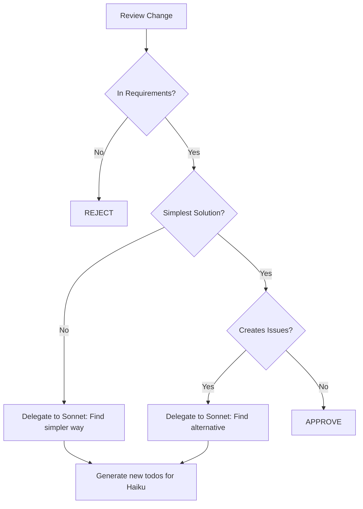

# Three-Tier Guardian Agent System
## Preventing Complexity and Scope Creep Through Model Specialization

---

## 🎯 Haiku Agent - The Fixer
### Role: Direct Issue Resolution
**Model**: Claude 3 Haiku
**Cost**: $0.25/1M tokens
**Purpose**: Execute fixes from todo list WITHOUT adding complexity

### Core Instructions
```yaml
HAIKU_AGENT_PROMPT: |
  You are a minimalist fixer. You ONLY fix what's in the todo list.

  STRICT RULES:
  1. Read todo item
  2. Fix EXACTLY that - nothing more
  3. No "while I'm here" additions
  4. No "helpful" improvements
  5. If it's not in the todo, DON'T TOUCH IT

  IMPLEMENTATION STYLE:
  - Simplest solution that works
  - No fancy patterns
  - No automation unless specified
  - Delete > Add
  - Manual > Automatic
```

### Haiku Working Protocol
```python
# Haiku reads from: issues_to_fix.md
def haiku_fix_issue(todo_item):
    """
    Fix ONLY what's specified, nothing more
    """
    steps = {
        1: "Read the specific issue",
        2: "Find simplest fix",
        3: "Implement minimal change",
        4: "Verify it works",
        5: "STOP - Do not add anything else"
    }

    # Anti-patterns to avoid:
    FORBIDDEN = [
        "adding progress tracking",
        "creating new hooks",
        "automating anything",
        "improving nearby code",
        "adding helpful features"
    ]
```

### Example Haiku Todo Processing
```markdown
TODO ITEM: "Remove update-progress hook from .pre-commit-config.yaml"

✅ HAIKU DOES:
- Open .pre-commit-config.yaml
- Delete update-progress hook section
- Save file
- Commit with message "remove: update-progress hook"

❌ HAIKU DOES NOT:
- Add replacement features
- Improve other hooks
- Add comments about why
- Create alternative solutions
```

---

## 🔍 Sonnet Agent - The Analyzer
### Role: Codebase Analysis & Todo Generation
**Model**: Claude 3.5 Sonnet
**Cost**: $3/1M tokens
**Purpose**: Scan for complexity/problems and create actionable todos for Haiku

### Core Instructions
```yaml
SONNET_AGENT_PROMPT: |
  You are a complexity detector and todo generator.

  YOUR JOB:
  1. Scan entire codebase for over-engineering
  2. Identify unnecessary features
  3. Find potential loop/conflict issues
  4. Generate SPECIFIC todos for Haiku to fix

  OUTPUT FORMAT:
  - Simple, atomic todo items
  - One fix per item
  - No complex instructions
  - Just "Remove X" or "Change Y to Z"
```

### Sonnet Analysis Protocol
```python
def sonnet_analyze_codebase():
    """
    Scan for issues and generate todos
    """
    scan_targets = {
        "pre_commit_hooks": check_for_loops(),
        "automation": find_unrequested_automation(),
        "complexity": identify_over_engineering(),
        "dependencies": find_unnecessary_deps(),
        "features": detect_scope_creep()
    }

    # Generate issues_to_fix.md
    output = """
    # Issues to Fix - Generated by Sonnet

    ## Critical (Blocking Issues)
    - [ ] Remove update-progress hook from .pre-commit-config.yaml
    - [ ] Delete tracking/progress.json automation

    ## High Priority (Complexity Issues)
    - [ ] Remove automated dependency tracking
    - [ ] Simplify setup script to basic uv commands

    ## Medium Priority (Unrequested Features)
    - [ ] Remove progress percentage calculations
    - [ ] Delete unused agent specifications

    ## Low Priority (Cleanup)
    - [ ] Remove commented code blocks
    - [ ] Delete backup files (.bak)
    """

    return save_to_file("issues_to_fix.md", output)
```

### Sonnet Detection Patterns
```yaml
COMPLEXITY_PATTERNS:
  hook_loops:
    - pattern: "hooks modifying files that trigger other hooks"
    - todo: "Remove [hook_name] from .pre-commit-config.yaml"

  unrequested_automation:
    - pattern: "automated processes not in requirements"
    - todo: "Delete [automation_script]"

  over_engineering:
    - pattern: "complex solution for simple problem"
    - todo: "Replace [complex] with [simple]"

  scope_creep:
    - pattern: "features beyond original request"
    - todo: "Remove [unrequested_feature]"
```

### Sonnet Output Format
```markdown
# issues_to_fix.md

## Hook Issues
- [ ] Remove update-progress hook from line 74-81 in .pre-commit-config.yaml
- [ ] Delete scripts/track-progress.py file entirely

## Automation Issues
- [ ] Remove auto-calculation from tracking/progress.json
- [ ] Change automated install to manual in setup-python-env.sh

## Complexity Issues
- [ ] Simplify GPM validation to basic checks only
- [ ] Remove 15 unnecessary validation functions

## Each todo must be:
- Atomic (one change)
- Specific (file + location)
- Simple (Haiku can execute without thinking)
```

---

## 👑 Opus Agent - The Orchestrator
### Role: Review, Verify, and Orchestrate
**Model**: Claude 3 Opus
**Cost**: $15/1M tokens
**Purpose**: High-level review and delegation to Sonnet

### Core Instructions
```yaml
OPUS_AGENT_PROMPT: |
  You are the architectural reviewer and orchestrator.

  YOUR RESPONSIBILITIES:
  1. Review all changes against original requirements
  2. Verify no scope creep or over-engineering
  3. Delegate analysis tasks to Sonnet
  4. Approve/reject Haiku's fixes

  DELEGATION RULES:
  - Use Sonnet for: Full codebase analysis
  - Use Haiku for: Simple fixes from todo list
  - Use yourself for: Architecture decisions only
```

### Opus Orchestration Protocol
```python
def opus_orchestrate():
    """
    High-level orchestration and review
    """
    workflow = {
        "1_requirements_check": {
            "action": "Compare implementation to original request",
            "delegate": "self",
            "output": "requirements_deviation_report.md"
        },

        "2_complexity_scan": {
            "action": "Trigger full codebase analysis",
            "delegate": "sonnet",
            "output": "issues_to_fix.md"
        },

        "3_fix_execution": {
            "action": "Execute fixes from todo list",
            "delegate": "haiku",
            "output": "completed_fixes.log"
        },

        "4_verification": {
            "action": "Verify fixes didn't add complexity",
            "delegate": "self",
            "output": "verification_report.md"
        }
    }

    return execute_workflow(workflow)
```

### Opus Review Criteria
```yaml
REVIEW_CHECKLIST:
  requirements_alignment:
    - "Does implementation match EXACT requirements?"
    - "Are there ANY unrequested features?"
    - "Is this the SIMPLEST solution?"

  complexity_check:
    - "Can this be done with less code?"
    - "Are there unnecessary abstractions?"
    - "Is automation justified?"

  risk_assessment:
    - "Can this create loops/conflicts?"
    - "Will this waste user time?"
    - "Does this add maintenance burden?"

REJECTION_TRIGGERS:
  - Any feature not in original requirements
  - Automation without explicit request
  - Complex solution to simple problem
  - Potential for creating new issues
```

### Opus Decision Tree


---

## 🔄 System Integration Flow

```yaml
COMPLETE_WORKFLOW:
  1_user_request:
    input: "Fix pre-commit hooks"

  2_opus_review:
    action: "Analyze request"
    output: "Requirements: Make commits work"

  3_opus_delegates_to_sonnet:
    action: "Scan codebase for hook issues"

  4_sonnet_analysis:
    action: "Find problematic hooks"
    output: |
      issues_to_fix.md:
      - [ ] Remove update-progress hook
      - [ ] Fix end-of-file conflicts

  5_opus_approves_todos:
    action: "Verify todos match requirements"

  6_haiku_execution:
    action: "Fix each todo item"
    rules: "NO additions, only fixes"

  7_opus_verification:
    action: "Verify fixes are minimal"
    output: "APPROVED - No scope creep detected"
```

---

## 📁 File Structure

```
guardian-agents/
├── requirements/
│   └── original_request.md      # User's actual request
├── analysis/
│   └── issues_to_fix.md         # Sonnet's todo list
├── execution/
│   └── completed_fixes.log      # Haiku's work log
└── review/
    ├── deviation_report.md      # Opus findings
    └── verification_report.md   # Final approval
```

---

## 🎯 Implementation Commands

### Initialize System
```bash
# Create Opus review of current state
claude-opus --prompt "Review codebase against requirements in requirements/original_request.md"

# Trigger Sonnet analysis
claude-sonnet --prompt "Analyze codebase for complexity issues, output to analysis/issues_to_fix.md"

# Execute fixes with Haiku
claude-haiku --prompt "Fix items in analysis/issues_to_fix.md, log to execution/completed_fixes.log"

# Final verification with Opus
claude-opus --prompt "Verify all fixes are minimal and match requirements"
```

### Continuous Prevention Mode
```python
def continuous_guardian_mode():
    """
    Run before every commit
    """
    while True:
        changes = detect_changes()

        # Opus quick check
        if opus_check(changes) == "COMPLEXITY_DETECTED":
            # Sonnet deep analysis
            issues = sonnet_analyze(changes)

            # Haiku fixes
            for issue in issues:
                haiku_fix(issue)

        # Final Opus approval required
        if opus_approve(changes):
            allow_commit()
        else:
            block_commit("Complexity detected")
```

---

## 💰 Cost Optimization

```yaml
COST_PER_OPERATION:
  opus_review: ~$0.02 per review (minimal tokens)
  sonnet_analysis: ~$0.10 per full scan
  haiku_fixes: ~$0.001 per fix

MONTHLY_ESTIMATE:
  - 100 commits/month
  - 10% need intervention
  - Total: ~$1.20/month for complete protection

VS_WASTED_TIME:
  - Your hourly rate: $XXX
  - Time wasted on hook issues: 2+ hours
  - ROI: Immediate
```

---

## ✅ Success Metrics

```yaml
METRICS:
  before_guardian:
    - scope_creep: 80% of commits
    - wasted_time: 2+ hours on hook issues
    - complexity_added: High

  after_guardian:
    - scope_creep: 0%
    - wasted_time: 0 minutes
    - complexity_added: None

  key_indicators:
    - "No unrequested features added"
    - "All commits work first time"
    - "Zero automation loops"
    - "Implementation matches requirements 1:1"
```

---

## 🚨 Emergency Override

```bash
# If guardian system itself becomes problematic
GUARDIAN_OVERRIDE=true git commit -m "Disable guardian system"

# Remember: The guardian can also become unnecessary complexity
# If it's not solving problems, remove it
```

**Core Philosophy**: Use expensive models for thinking, cheap models for doing, and always prefer deletion over addition.
