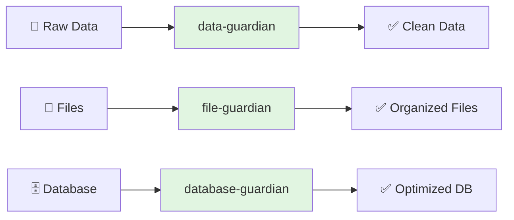
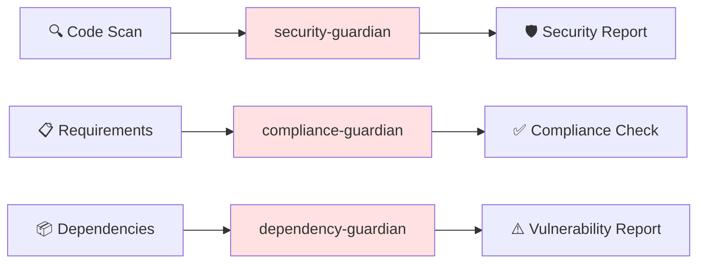
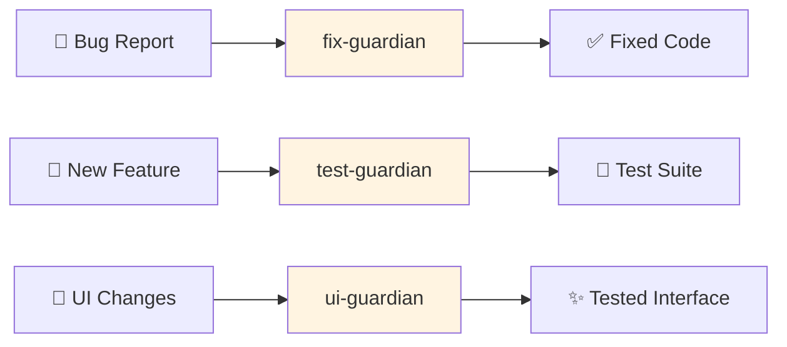
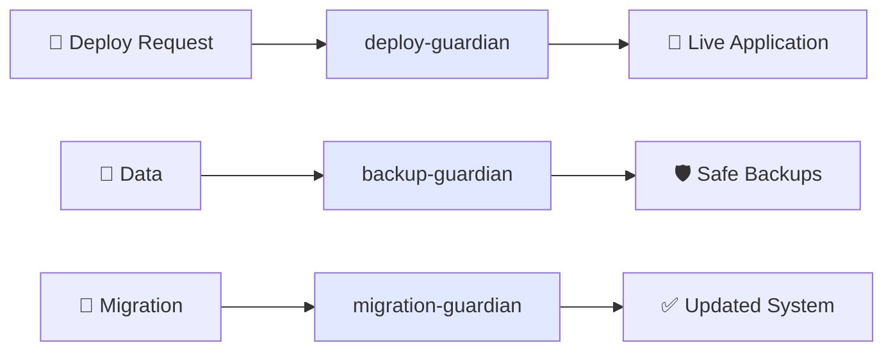
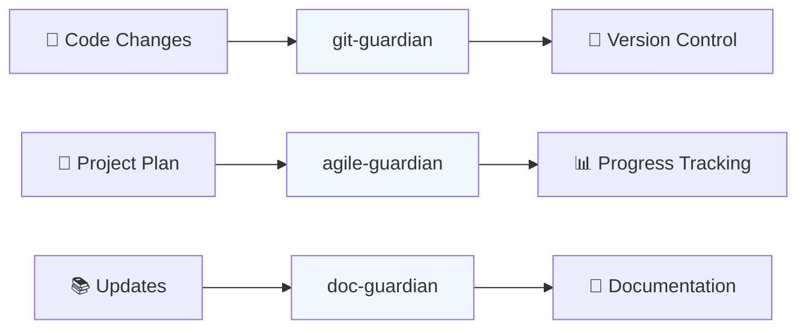
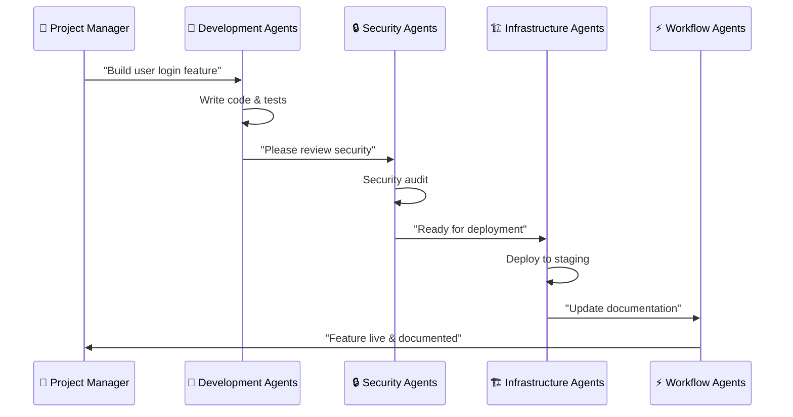

# 📊 Visual Agent Overview - For Non-Developers

This guide explains what each Guardian Agent does using simple terms and visual workflows.

## 🎯 What is a Guardian Agent?

Think of Guardian Agents as specialized team members, each with their own job:
- **Security Guardian** = Your security expert who checks for vulnerabilities
- **Test Guardian** = Your QA tester who makes sure everything works
- **Deploy Guardian** = Your DevOps engineer who handles releases

## 🏗️ Agent Categories Explained

### 📧 Data Processing Agents
**What they do**: Handle your project's data - files, databases, imports/exports

**When to use**: When you have data to process, files to organize, or databases to optimize.

### 🔒 Security & Compliance Agents
**What they do**: Keep your project secure and compliant with regulations

**When to use**: Before releasing features, during security audits, for regulatory compliance.

### 🧪 Development & Testing Agents
**What they do**: Write code, fix bugs, and test everything works properly

**When to use**: During development, after making changes, before releases.

### 🏗️ Infrastructure Agents
**What they do**: Manage servers, deployments, backups, and system health

**When to use**: For deployments, system updates, disaster recovery planning.

### ⚡ Workflow Agents
**What they do**: Manage the development process, documentation, and releases

**When to use**: Throughout the development lifecycle for coordination and documentation.

## 🔄 How Agents Work Together

### Example: Launching a New Feature

## 🎯 Quick Decision Guide

**Need help with...**

| Scenario | Use This Agent | What It Does |
|----------|---------------|--------------|
| 🐛 Bug fixing | fix-guardian | Automatically fixes code issues |
| 🔐 Security check | security-guardian | Scans for vulnerabilities |
| 🧪 Testing | test-guardian | Creates and runs tests |
| 🚀 Deployment | deploy-guardian | Pushes code to production |
| 📊 Data processing | data-guardian | Cleans and validates data |
| 📝 Documentation | doc-guardian | Updates project docs |
| 💾 Backups | backup-guardian | Creates system backups |
| 📋 Project tracking | agile-guardian | Tracks development progress |

## 🚀 Getting Started (Simple Steps)

1. **Identify Your Need**: Look at the table above
2. **Choose Your Agent**: Find the matching guardian
3. **Follow the Workflow**: Each agent has a simple workflow diagram
4. **Review Results**: Agents provide clear status updates

## 💡 Real-World Examples

### E-commerce Website
- **data-guardian**: Process customer orders
- **security-guardian**: Protect payment info
- **ui-guardian**: Test shopping cart
- **deploy-guardian**: Launch new features

### Mobile App
- **file-guardian**: Handle user uploads
- **test-guardian**: Test on different devices
- **backup-guardian**: Backup user data
- **release-guardian**: App store deployment

### Internal Tool
- **database-guardian**: Optimize queries
- **compliance-guardian**: Meet company policies
- **doc-guardian**: User manuals
- **agile-guardian**: Track development

---

**Next Steps**:
- 🔍 [Find Your Agent](../docs/workflows/) - See specific workflows
- 📚 [Use Cases](use-cases.md) - More detailed examples
- ❓ [FAQ](faq.md) - Common questions
