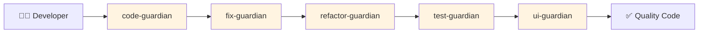
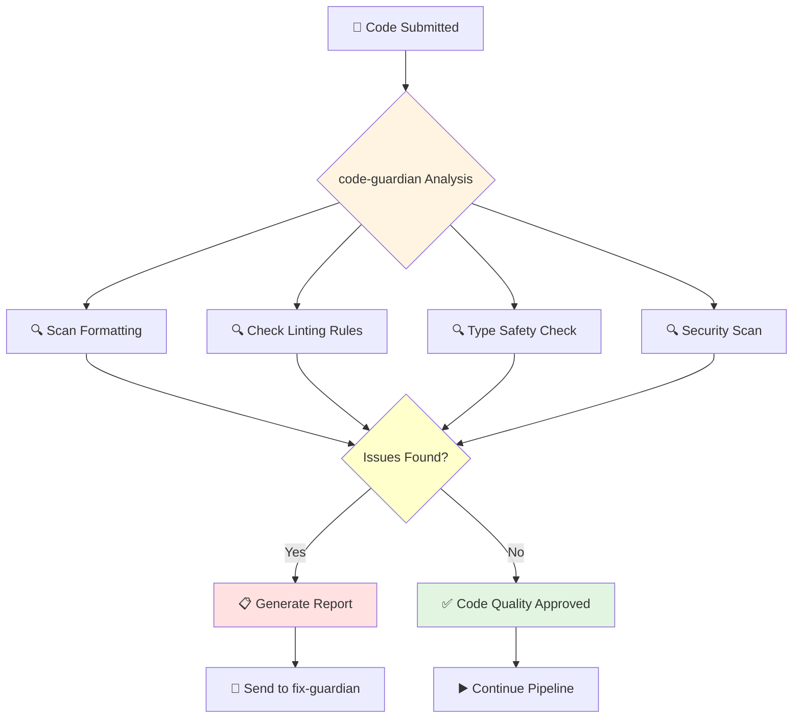
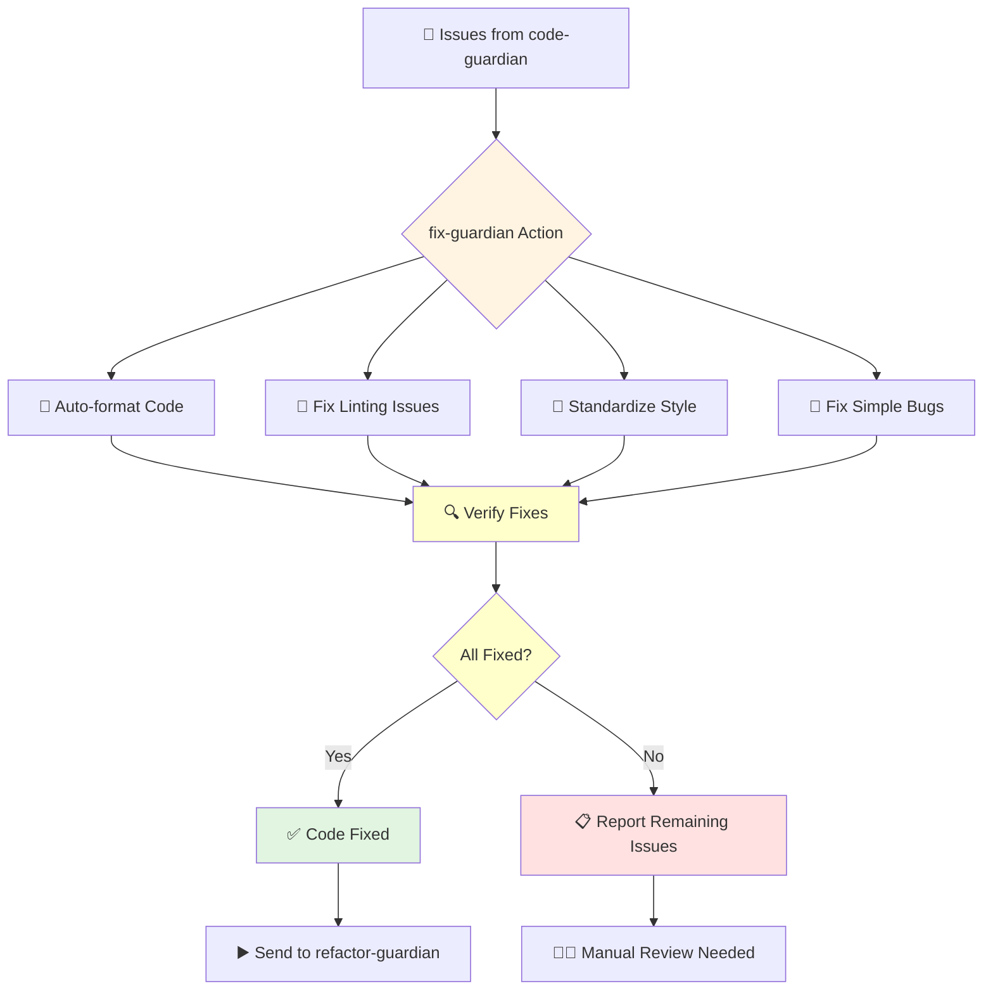
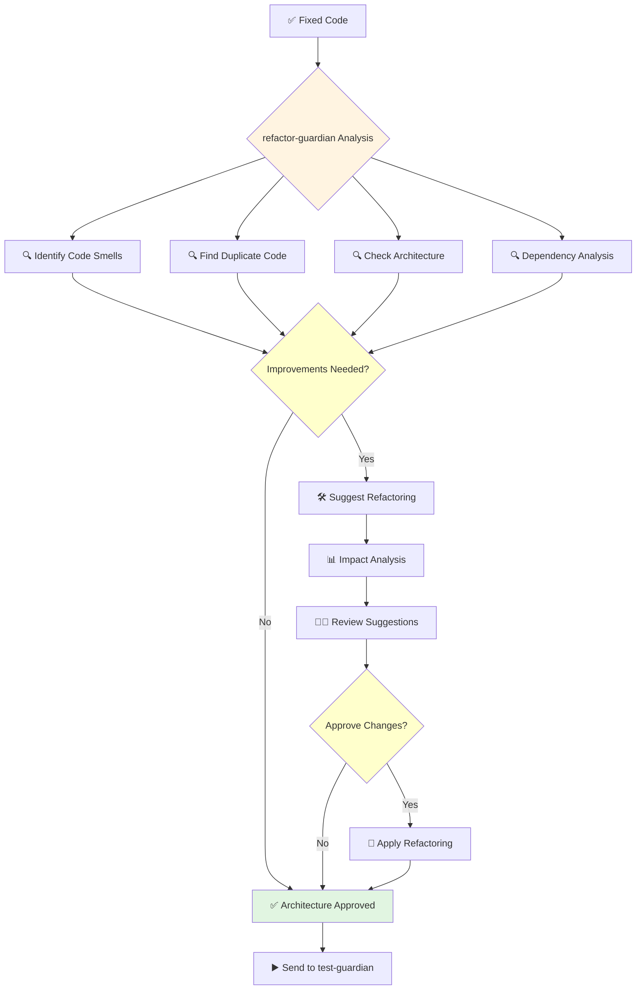
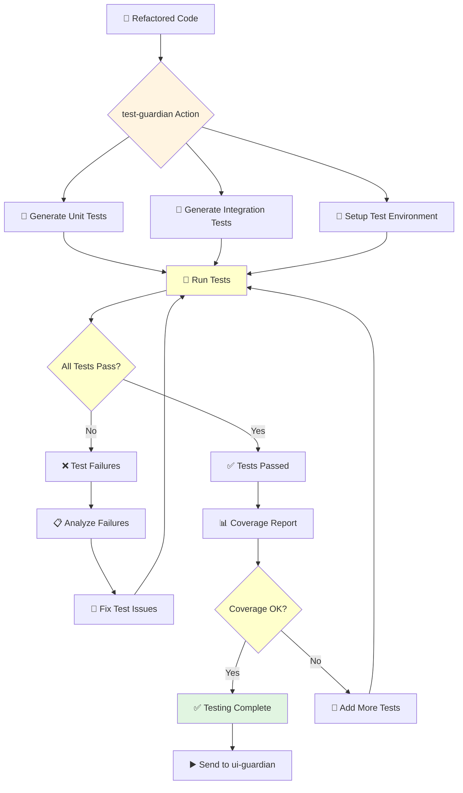
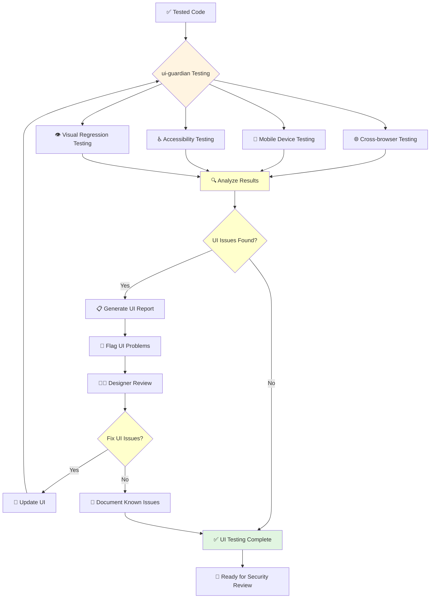
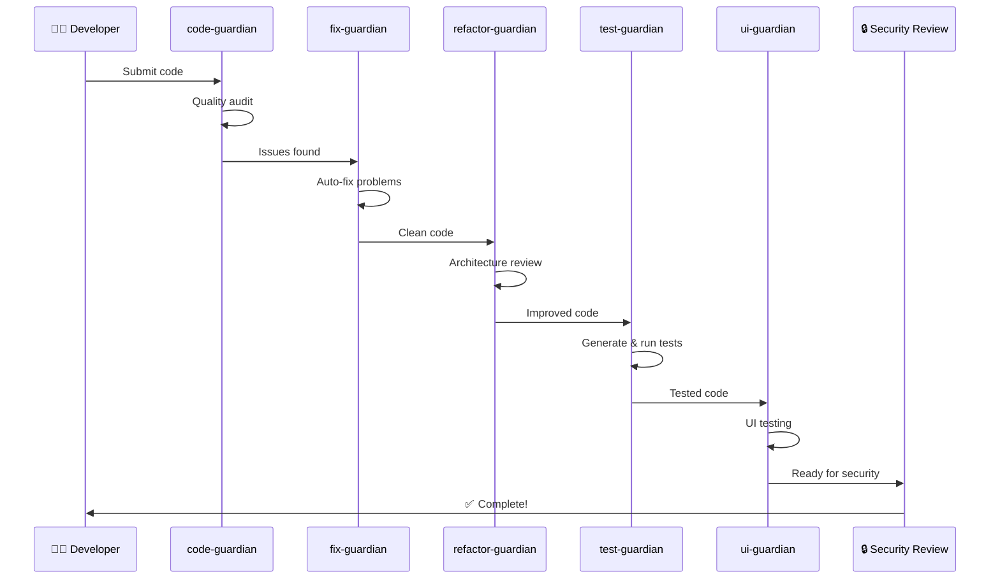

# 🧪 Development Agents Workflow

This document shows how Development & Testing Agents work with **verified Claude Code subagent chaining** support.

## Agent Overview

## 1. Code Guardian Workflow

**Purpose**: Audit code quality without making changes

**What you see**:
- ✅ **Green**: Code passes quality checks  
- 🚨 **Red**: Issues found, needs fixing
- 📋 **Report**: Detailed list of problems

## 2. Fix Guardian Workflow

**Purpose**: Automatically fix code formatting and issues

**What happens**:
- 🔧 **Auto-fixes**: Format, style, simple errors
- 📋 **Complex issues**: Flagged for human review
- ✅ **Success**: Code ready for refactoring

## 3. Refactor Guardian Workflow

**Purpose**: Improve code architecture and reduce technical debt

**What it does**:
- 🔍 **Analyzes**: Code structure and patterns
- 🛠️ **Suggests**: Architecture improvements
- 📊 **Impact**: Shows what changes affect
- 🔄 **Refactors**: Improves code quality

## 4. Test Guardian Workflow

**Purpose**: Generate and execute comprehensive tests

**What happens**:
- 📝 **Creates**: Unit and integration tests
- 🧪 **Runs**: All test suites
- 📊 **Coverage**: Ensures adequate test coverage
- ✅ **Reports**: Test results and recommendations

## 5. UI Guardian Workflow

**Purpose**: Test user interfaces across browsers and devices

**What it tests**:
- 🌐 **Browsers**: Chrome, Firefox, Safari, Edge
- 📱 **Devices**: Mobile, tablet, desktop
- ♿ **Accessibility**: Screen readers, keyboard navigation  
- 👁️ **Visual**: Layout and appearance consistency

## Complete Development Pipeline

## 🎯 Quick Reference

| Agent | Input | Output | Time |
|-------|-------|--------|------|
| code-guardian | Raw code | Quality report | 2-5 min |
| fix-guardian | Issues list | Fixed code | 1-3 min |
| refactor-guardian | Fixed code | Improved architecture | 5-10 min |
| test-guardian | Clean code | Test suite + results | 5-15 min |
| ui-guardian | Tested code | UI validation | 10-20 min |

**Total Pipeline Time**: 23-53 minutes (varies by code complexity)

---

**Need Help?**
- 📞 [Contact Support](../support.md)
- 📚 [Agent Configuration](../technical/agent-config.md)
- 🔧 [Troubleshooting](../troubleshooting.md)