# 🧪 Three-Tier Guardian System Workflow

This document shows how the Three-Tier Guardian Agent System works to maintain project quality and prevent scope creep.

## Agent Overview

```mermaid
graph LR
    A[👨‍💻 Developer] --> B[architectural-orchestrator]
    B --> C[codebase-complexity-analyzer]
    C --> D[minimal-todo-fixer]
    D --> B

    style B fill:#e1f5e1
    style C fill:#fff4e1
    style D fill:#e1e8ff
```

## 1. Orchestrator Workflow

**Purpose**: High-level review and delegation.

## 2. Analyzer Workflow

**Purpose**: Codebase analysis and todo generation.

## 3. Fixer Workflow

**Purpose**: Automatically fix code formatting and issues.

```mermaid
flowchart TD
    A[📋 issues_to_fix.md] --> B{minimal-todo-fixer Action}
    B --> C[🔧 Fix Issue 1]
    B --> D[🔧 Fix Issue 2]
    B --> E[🔧 ...]

    C --> F[🔍 Verify Fix]
    D --> F
    E --> F

    F --> G{All Fixed?}
    G -->|Yes| H[✅ All Issues Fixed]
    G -->|No| I[📋 Report Remaining Issues]

    H --> J[▶️ Report to architectural-orchestrator]
    I --> J

    style B fill:#e1e8ff
    style F fill:#ffffcc
    style G fill:#ffffcc
    style H fill:#e1f5e1
    style I fill:#ffe1e1
```

## Complete Development Pipeline

```mermaid
sequenceDiagram
    participant Dev as 👨‍💻 Developer
    participant Orchestrator as architectural-orchestrator
    participant Analyzer as codebase-complexity-analyzer
    participant Fixer as minimal-todo-fixer

    Dev->>Orchestrator: Submit code
    Orchestrator->>Orchestrator: Review changes
    Orchestrator->>Analyzer: Delegate analysis
    Analyzer->>Analyzer: Scan codebase
    Analyzer->>Fixer: Generate issues_to_fix.md
    Fixer->>Fixer: Fix all issues
    Fixer->>Orchestrator: Report completion
    Orchestrator->>Orchestrator: Verify fixes
    Orchestrator->>Dev: ✅ Complete!
```

---

**Need Help?**
- 📞 [Contact Support](../support.md)
- 📚 [Agent Configuration](../technical/agent-config.md)
- 🔧 [Troubleshooting](../troubleshooting.md)