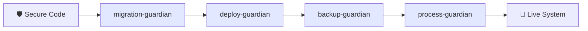
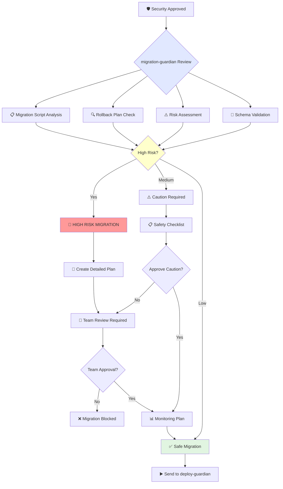
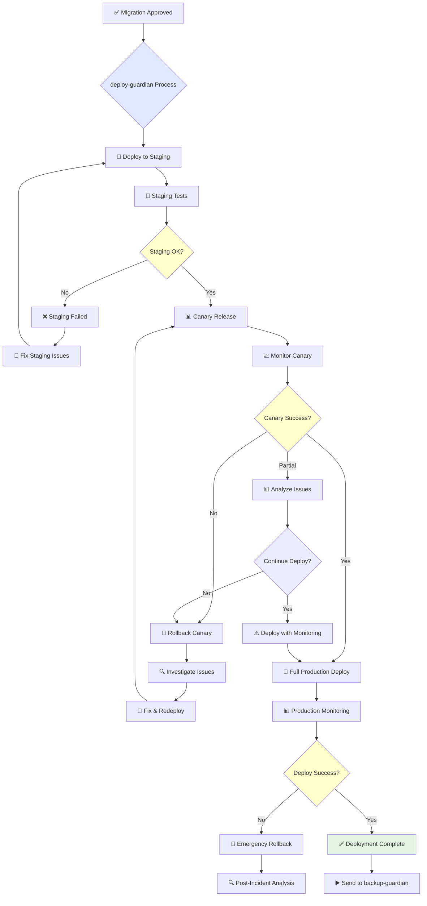
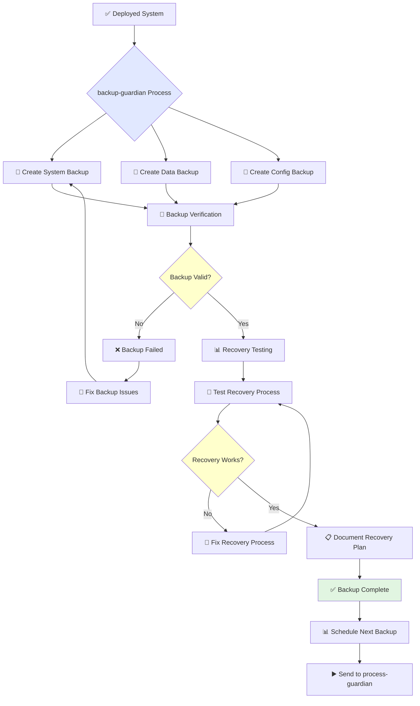
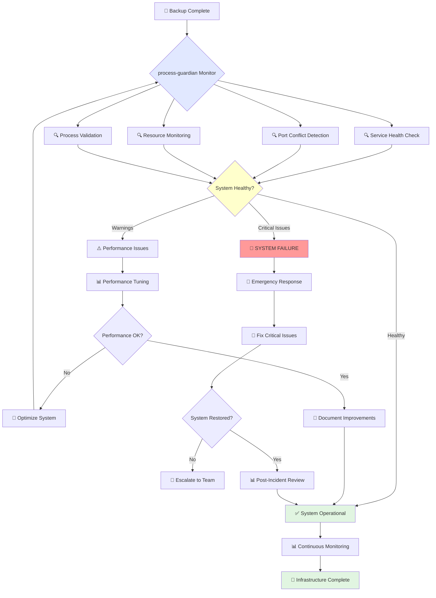
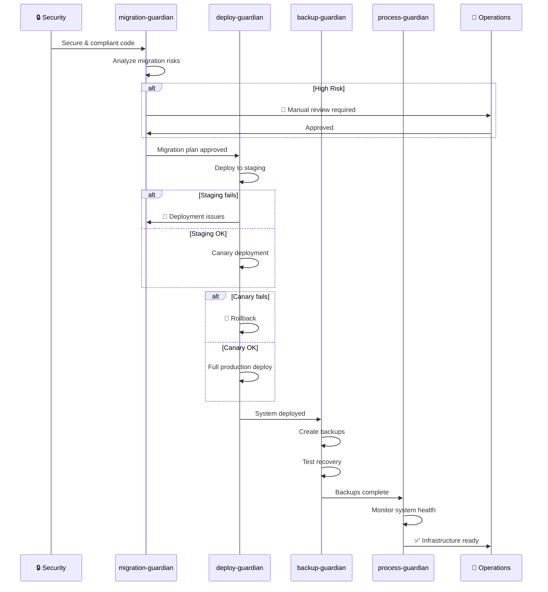

# 🏗️ Infrastructure Agents Workflow

This document shows how Infrastructure Agents manage deployment, backup, and system operations.

## Agent Overview

## 1. Migration Guardian Workflow

**Purpose**: Review and validate database/system migrations safely

**Migration Types**:
- 🗄️ **Database**: Schema changes, data migrations
- 🔧 **System**: Configuration updates
- 📦 **Dependencies**: Library upgrades
- 🏗️ **Architecture**: Infrastructure changes

## 2. Deploy Guardian Workflow

**Purpose**: Manage software deployments with staged rollouts

**Deployment Stages**:
- 🧪 **Staging**: Test environment validation
- 🕯️ **Canary**: Limited production release
- 📊 **Monitoring**: Real-time health checks
- 🚀 **Production**: Full rollout
- 🔄 **Rollback**: Emergency recovery

## 3. Backup Guardian Workflow

**Purpose**: Ensure disaster recovery readiness and data protection

**Backup Types**:
- 💾 **Full System**: Complete infrastructure backup
- 💾 **Database**: Data and schema backup
- 💾 **Configuration**: Settings and environment
- 💾 **Code**: Source code snapshots
- 💾 **User Data**: Application data backup

## 4. Process Guardian Workflow

**Purpose**: Validate multi-service orchestration and system health

**Monitoring Areas**:
- 🔍 **Services**: Application health status
- 🔍 **Resources**: CPU, memory, disk usage
- 🔍 **Network**: Connectivity and performance
- 🔍 **Processes**: Running services validation
- 🔍 **Dependencies**: External service health

## Complete Infrastructure Pipeline

## 🎯 Quick Reference

| Agent | Purpose | Critical Actions | Time |
|-------|---------|------------------|------|
| migration-guardian | Safe migrations | Risk analysis, rollback plans | 10-30 min |
| deploy-guardian | Staged deployment | Canary → Production | 20-60 min |
| backup-guardian | Data protection | Backup + recovery testing | 15-45 min |
| process-guardian | System monitoring | Health checks, optimization | Continuous |

**Total Infrastructure Setup**: 45-135 minutes (one-time)
**Ongoing Monitoring**: Continuous process

## 🚨 Emergency Procedures

### Deployment Failure
1. 🔄 **Automatic Rollback**: deploy-guardian triggers
2. 🔍 **Impact Assessment**: Check affected services
3. 🚨 **Team Notification**: Alert operations team
4. 📝 **Incident Log**: Document for analysis

### System Failure
1. 🚨 **Alert Triggered**: process-guardian detects issue
2. 💾 **Recovery Initiated**: backup-guardian restores
3. 🔧 **Service Restart**: Attempt automatic recovery
4. 👥 **Escalation**: Manual intervention if needed

### Data Loss
1. 💾 **Backup Verification**: Check backup integrity
2. 🔄 **Recovery Process**: Restore from latest backup
3. 📊 **Data Validation**: Verify restored data
4. 📋 **Recovery Report**: Document recovery steps

## 📊 Monitoring Dashboards

### System Health
- 🟢 **Green**: All systems operational
- 🟡 **Yellow**: Performance warnings
- 🔴 **Red**: Critical issues detected

### Deployment Status
- 🧪 **Staging**: Testing in progress
- 🕯️ **Canary**: Limited production release
- 🚀 **Production**: Full deployment
- 🔄 **Rollback**: Recovery in progress

### Backup Status
- 💾 **Last Backup**: Timestamp and status
- 🧪 **Recovery Test**: Last successful test
- 📊 **Backup Size**: Storage usage
- ⏰ **Next Backup**: Scheduled time

---

**Infrastructure Support**:
- 🚨 [Emergency Contacts](../support/emergency.md)
- 📊 [Monitoring Dashboard](../tools/monitoring.md)
- 🔧 [Troubleshooting Guide](../support/troubleshooting.md)