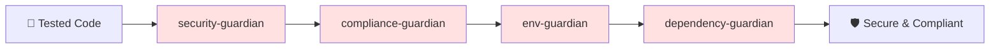
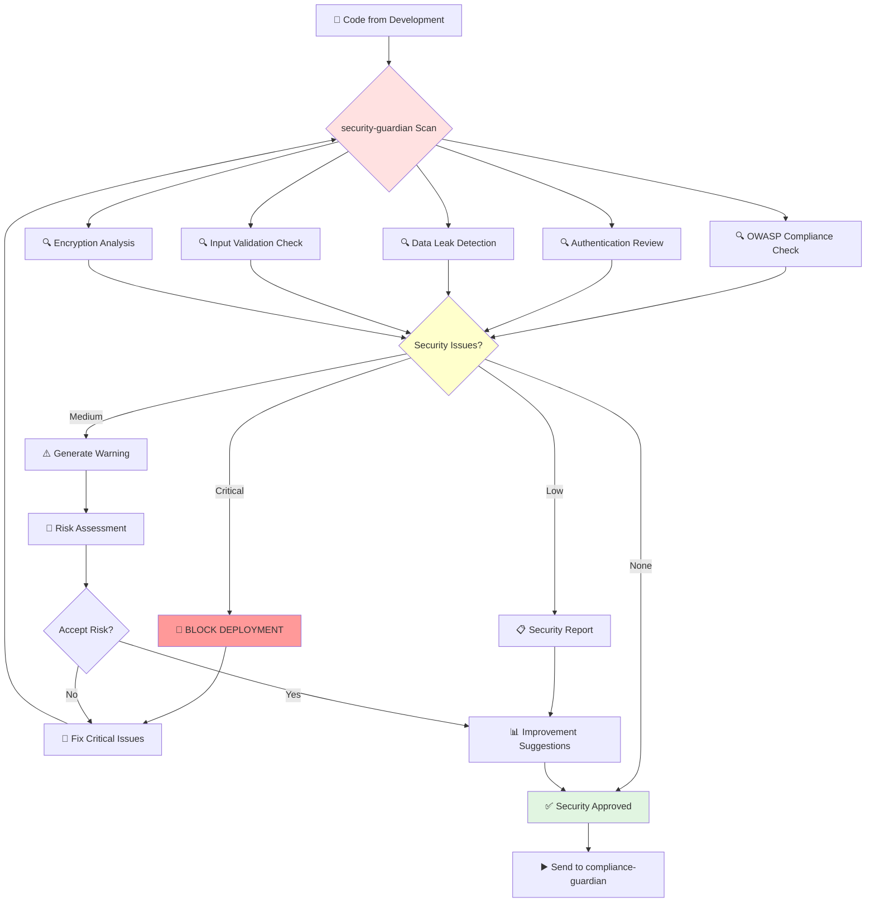
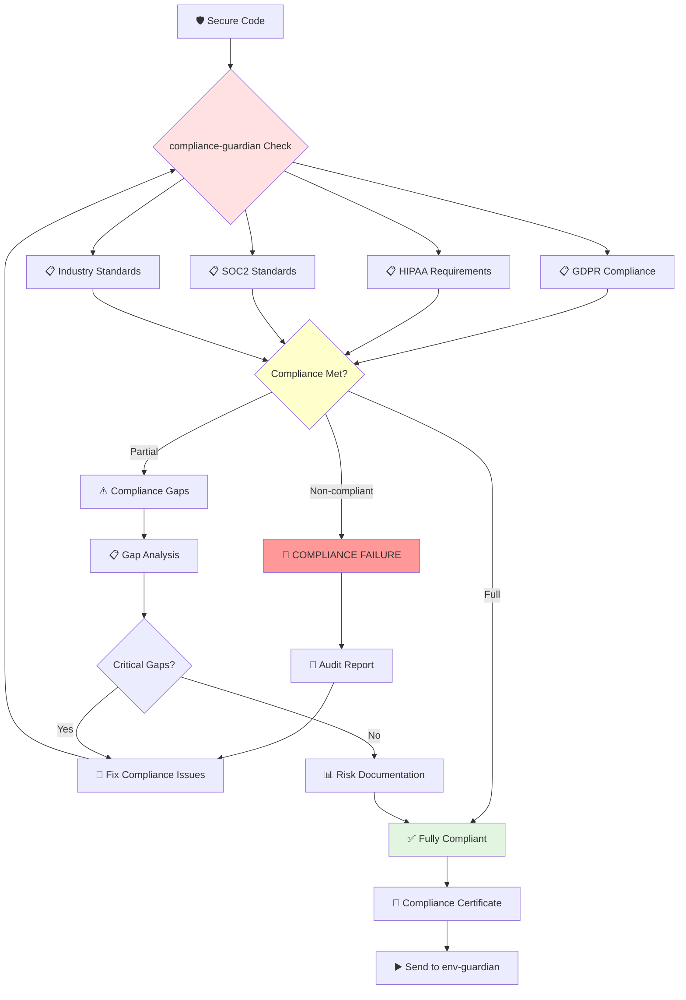
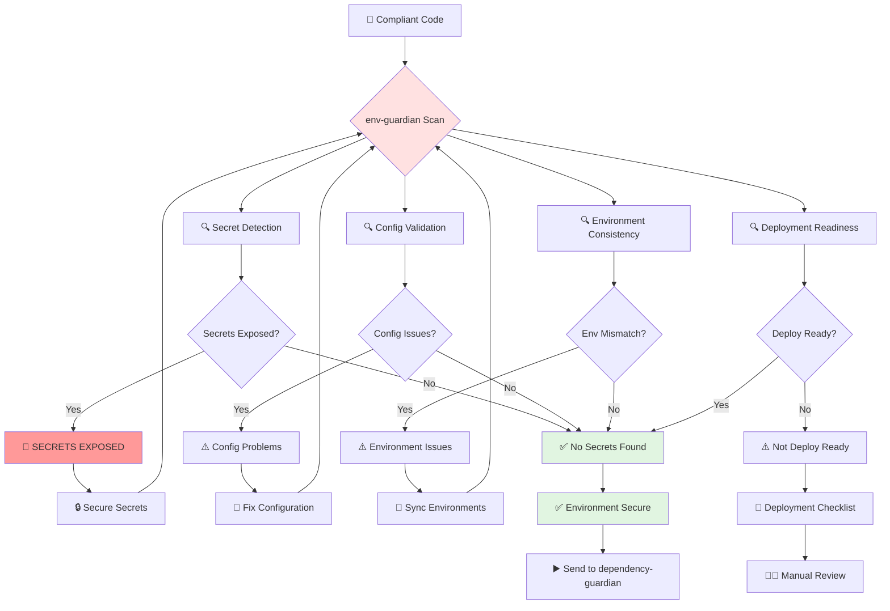
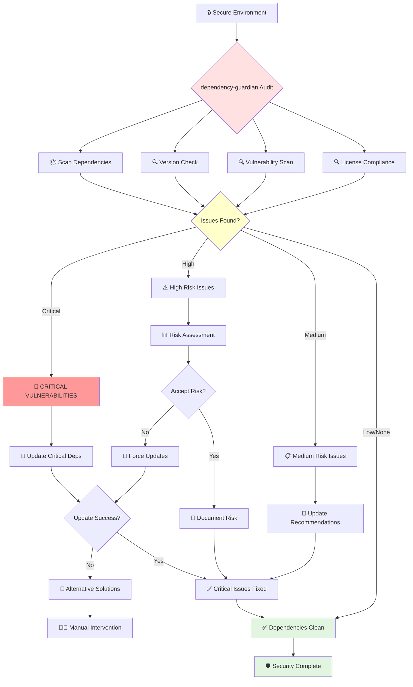
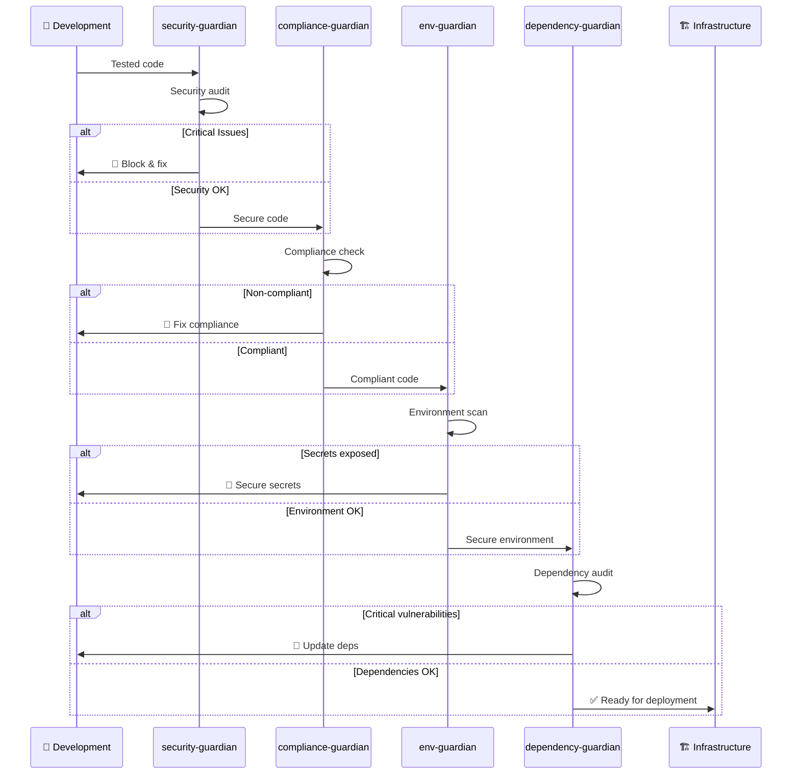

# 🔒 Security & Compliance Agents Workflow

This document shows how Security & Compliance Agents protect your project step-by-step.

## Agent Overview

## 1. Security Guardian Workflow

**Purpose**: Comprehensive security audit and vulnerability assessment

**Security Checks**:
- 🔍 **SQL Injection**: Database query safety
- 🔍 **XSS Protection**: Cross-site scripting prevention
- 🔍 **Authentication**: Login and session security
- 🔍 **Data Protection**: Sensitive information handling
- 🔍 **API Security**: Endpoint protection

## 2. Compliance Guardian Workflow

**Purpose**: Verify regulatory compliance (GDPR, HIPAA, SOC2, etc.)

**Compliance Areas**:
- 📋 **Data Privacy**: GDPR, CCPA compliance
- 📋 **Healthcare**: HIPAA for medical data
- 📋 **Finance**: PCI DSS for payments
- 📋 **Security**: SOC2 for security controls
- 📋 **Industry**: Sector-specific regulations

## 3. Environment Guardian Workflow

**Purpose**: Validate environment configurations and detect secrets

**Environment Checks**:
- 🔍 **API Keys**: No hardcoded secrets
- 🔍 **Database**: Connection strings secured
- 🔍 **Certificates**: SSL/TLS properly configured
- 🔍 **Permissions**: Access controls validated
- 🔍 **Variables**: Environment-specific settings

## 4. Dependency Guardian Workflow

**Purpose**: Audit project dependencies for security vulnerabilities

**Dependency Analysis**:
- 📦 **Vulnerabilities**: Known security issues
- 🔍 **Outdated**: Old versions with fixes
- 🔍 **Licenses**: Legal compliance check
- 🔍 **Compatibility**: Version conflicts
- 🔍 **Alternatives**: Safer replacements

## Complete Security Pipeline

## 🎯 Quick Reference

| Agent | Primary Check | Block Deployment? | Time |
|-------|---------------|------------------|------|
| security-guardian | Vulnerabilities | Yes (Critical) | 5-10 min |
| compliance-guardian | Regulations | Yes (Non-compliant) | 3-7 min |
| env-guardian | Secrets/Config | Yes (Secrets exposed) | 2-5 min |
| dependency-guardian | Package security | Yes (Critical vulns) | 3-8 min |

**Total Security Pipeline**: 13-30 minutes

## 🚨 Common Security Issues

### Critical (Deployment Blocked)
- 🔓 Hardcoded passwords/API keys
- 🕳️ SQL injection vulnerabilities  
- 🔓 Insecure authentication
- ⚖️ Non-compliance with regulations

### Warning (Review Required)
- ⏰ Outdated dependencies
- 🔧 Weak encryption
- 📝 Missing security headers
- 🔍 Insufficient input validation

### Info (Recommendations)
- 📊 Security best practices
- 🔄 Dependency updates available
- 📋 Documentation improvements
- 🎯 Performance optimizations

---

**Emergency Security Response**:
- 🚨 [Security Incident Guide](../security/incident-response.md)
- 📞 [Emergency Contacts](../security/contacts.md)
- 🔧 [Quick Fixes](../security/quick-fixes.md)