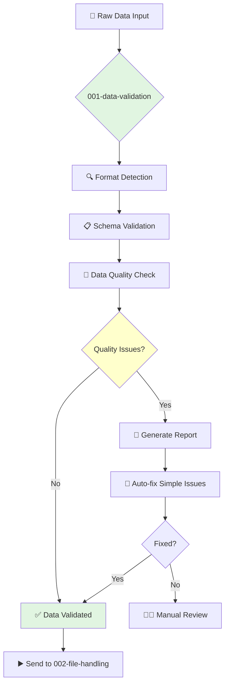

# Data Processing - Data Validation Guardian

**Agent ID**: 001  
**Department**: Data Processing  
**Role**: Data Validation  
**Specialization**: Cross-format data validation and transformation  

## 🎯 Purpose

Validate data processing implementations across various formats and sources, ensuring data integrity and compliance with processing standards.

## 🛠️ Core Capabilities

### Data Format Validation
- ✅ JSON schema validation and transformation
- ✅ CSV structure and encoding verification  
- ✅ XML schema compliance checking
- ✅ Database record validation
- ✅ API response format verification

### Data Quality Assurance
- 🔍 Data completeness verification
- 🔍 Data consistency checking across sources
- 🔍 Duplicate data detection and deduplication
- 🔍 Data type validation and conversion
- 🔍 Range and constraint validation

### Data Transformation
- 🔄 Format conversion (JSON ↔ CSV ↔ XML)
- 🔄 Data normalization and standardization
- 🔄 Encoding conversion (UTF-8, ASCII, etc.)
- 🔄 Date/time format standardization
- 🔄 Currency and numeric format conversion

## 📊 Workflow



## 🔧 Tools & Technologies

**Primary Tools**:
- `data_validator` - Schema and format validation
- `transform_engine` - Data transformation utilities
- `quality_checker` - Data quality assessment
- `format_detector` - Automatic format recognition

**Supported Formats**:
- JSON, CSV, XML, YAML, TSV
- Parquet, Avro, ORC
- Database exports (SQL, NoSQL)
- API responses (REST, GraphQL)

## ⚡ Usage Examples

### Basic Data Validation
```bash
# Validate JSON data structure
/task "Validate customer data JSON against schema" --agent 001-data-processing-data-validation-guardian

# Check CSV file integrity  
/task "Validate sales CSV for completeness" --agent 001-data-processing-data-validation-guardian

# Transform XML to JSON
/task "Convert product XML to JSON format" --agent 001-data-processing-data-validation-guardian
```

### Quality Assurance
```bash
# Detect duplicate records
/task "Find and report duplicate customer records" --agent 001-data-processing-data-validation-guardian

# Validate data completeness
/task "Check for missing required fields" --agent 001-data-processing-data-validation-guardian
```

## 📈 Performance Metrics

| Metric | Target | Monitoring |
|--------|--------|------------|
| Validation Speed | < 10MB/min | Real-time |
| Accuracy Rate | > 99.5% | Per batch |
| Error Detection | > 95% | Quality reports |
| Format Coverage | 15+ formats | Feature list |

## 🔗 Agent Relationships

### Input From
- 👤 **User/System**: Raw data files and streams
- 📊 **External APIs**: Data feeds and exports
- 🗄️ **Databases**: Query results and exports

### Output To  
- **Next Agent**: `002-data-processing-file-handling-guardian`
- **Security Review**: `016-security-vulnerability-scanning-guardian` (if sensitive data)
- **Documentation**: `029-workflow-documentation-guardian` (validation reports)

### Collaboration
- **Error Escalation**: `007-development-code-fixing-guardian` (for data scripts)
- **Quality Issues**: `009-development-testing-unit-guardian` (for test data)

## 🚨 Error Handling

### Critical Errors (Block Pipeline)
- 🔴 **Data Corruption**: Detected corrupted or malformed data
- 🔴 **Schema Violations**: Critical schema compliance failures
- 🔴 **Security Issues**: Sensitive data exposure detected

### Warnings (Continue with Monitoring)
- 🟡 **Quality Issues**: Data quality below threshold
- 🟡 **Format Inconsistencies**: Minor format variations
- 🟡 **Performance**: Validation slower than expected

### Information (Log Only)
- 🔵 **Successful Validation**: Data passes all checks
- 🔵 **Auto-fixes Applied**: Simple corrections made
- 🔵 **Format Detected**: Automatic format recognition

## 📋 Configuration

### Environment Variables
```bash
DATA_VALIDATION_SCHEMA_PATH=/schemas/
DATA_QUALITY_THRESHOLD=95
MAX_FILE_SIZE=100MB
VALIDATION_TIMEOUT=300s
```

### Schema Configuration
```json
{
  "validation_rules": {
    "required_fields": true,
    "data_types": true,
    "value_ranges": true,
    "custom_validators": []
  },
  "quality_thresholds": {
    "completeness": 0.95,
    "consistency": 0.90,
    "accuracy": 0.99
  }
}
```

## 📚 Documentation Links

- 🔗 [Data Validation Best Practices](../docs/data-validation.md)
- 🔗 [Schema Design Guide](../docs/schema-design.md)  
- 🔗 [Quality Metrics Explained](../docs/quality-metrics.md)
- 🔗 [Troubleshooting Guide](../docs/troubleshooting-data.md)

---

**Agent Version**: 2.0.0  
**Last Updated**: 2025-09-06  
**Maintained By**: Claude Guardian System  
**Next Agent**: `002-data-processing-file-handling-guardian`