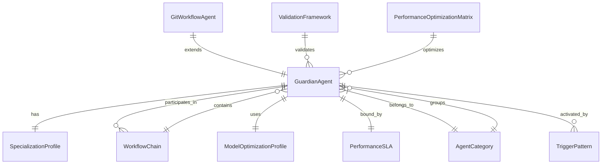

# Data Model: Guardian Agent Specialization System

**Date**: 2025-09-09
**Scope**: Entity definitions and relationships for the Guardian Agent system

## Core Entities

### Guardian Agent
**Description**: A specialized Claude subagent with unique role, capabilities, tools, and chaining behavior.

**Fields**:
```yaml
agent_id: string          # Format: NNN (001, 002, etc.)
name: string              # Format: NNN-department-role-specialization-guardian
description: string       # When to use this agent and triggers
department: enum          # Strategy, Design, Architecture, Development, Infrastructure, Operations
role: string             # Leadership, Senior, Junior, Director, etc.
specialization: string   # Specific expertise area
model: enum              # claude-3-5-haiku, claude-3-5-sonnet
tools: array[string]     # Available tool names
complexity: enum         # simple, complex, hybrid
status: enum             # active, deprecated, planned
```

**Validation Rules**:
- agent_id must be unique across system
- name must follow naming convention: `NNN-department-role-specialization-guardian`
- description must include "MUST BE USED" for auto-selection triggers
- model assignment must match complexity (simple→haiku, complex→sonnet)
- tools array must contain only valid Claude Code tool names

**State Transitions**:
```
planned → active → deprecated
active → active (updates allowed)
deprecated → active (reactivation allowed)
```

### Specialization Profile
**Description**: Defines agent's unique expertise area, distinguishing it from other agents.

**Fields**:
```yaml
profile_id: string           # Unique identifier
agent_id: string            # Foreign key to Guardian Agent
primary_responsibilities: array[string]    # Core capabilities
secondary_responsibilities: array[string]  # Optional capabilities
exclusions: array[string]   # Explicitly forbidden capabilities
domain_expertise: array[string]  # Technology/business domains
performance_sla: object     # Response time and quality targets
```

**Validation Rules**:
- primary_responsibilities must not overlap with other agents in same department
- exclusions must be explicitly defined to prevent scope creep
- performance_sla must align with model capabilities (Haiku <2s, Sonnet <10s)

### Workflow Chain
**Description**: Sequential and conditional relationships between agents that optimize development processes.

**Fields**:
```yaml
chain_id: string            # Unique identifier
name: string               # Descriptive name (e.g., "Feature Development Chain")
chain_type: enum           # sequential, conditional, parallel, hybrid
agents: array[object]      # Ordered list of agents in chain
  - agent_id: string
  - position: integer
  - condition: string      # Optional routing condition
  - parallel_group: string # Optional parallel execution group
triggers: array[string]    # Phrases that activate this chain
success_criteria: array[string]  # Chain completion requirements
```

**Validation Rules**:
- agents array must contain valid agent_ids
- sequential chains must have ordered positions
- conditional chains must have routing conditions
- triggers must be unique across chains

### Agent Category
**Description**: Grouping of agents by development lifecycle phase.

**Fields**:
```yaml
category_id: string         # Strategy, Design, Architecture, Development, Infrastructure, Operations
number_range: object       # Start and end numbers for category
  start: integer          # e.g., 001
  end: integer            # e.g., 020
description: string        # Category purpose
primary_handoff: string   # Next category in typical workflow
agents: array[string]     # List of agent_ids in this category
```

**Validation Rules**:
- number_range must not overlap between categories
- agent_ids must fall within category number range
- primary_handoff must reference valid category

### Trigger Pattern
**Description**: Specific phrases and conditions that activate automatic agent selection and chaining.

**Fields**:
```yaml
pattern_id: string         # Unique identifier
pattern_text: string      # Trigger phrase or regex pattern
agent_id: string          # Agent to activate
priority: integer         # Pattern matching priority (1=highest)
context_required: array[string]  # Required context for activation
examples: array[string]   # Example usage scenarios
```

**Validation Rules**:
- pattern_text must be unique or have different context_required
- priority must be positive integer
- agent_id must reference valid Guardian Agent

### Git Workflow Agent
**Description**: Specialized agents (101-112) for Git operations with model optimization and temporal tracking.

**Fields**:
```yaml
workflow_type: enum       # branch, commit, session, cleanup, merge, archive
temporal_format: string  # YYYYMMDD-HHMM timestamp format
automation_level: enum   # manual, semi-automated, fully-automated
branch_types: array[string]  # Supported branch types (feature, hotfix, etc.)
integration_points: array[string]  # Other Git agents this connects to
```

**Validation Rules**:
- workflow_type must be unique per agent
- temporal_format must follow YYYYMMDD-HHMM standard
- branch_types must be valid Git workflow types

### Model Optimization Profile
**Description**: Assignment of appropriate Claude model (Haiku/Sonnet) based on task complexity.

**Fields**:
```yaml
profile_id: string        # Unique identifier
complexity_indicators: object
  simple: array[string]   # Keywords indicating simple tasks
  complex: array[string] # Keywords indicating complex tasks
  hybrid: array[string]  # Keywords indicating mixed complexity
performance_targets: object
  haiku_sla: integer     # Response time SLA for Haiku (seconds)
  sonnet_sla: integer   # Response time SLA for Sonnet (seconds)
cost_optimization: object
  target_reduction: float  # Target cost reduction percentage
  quality_threshold: float # Minimum quality threshold
```

**Validation Rules**:
- complexity_indicators must not overlap between categories
- performance_targets must be realistic for model capabilities
- cost_optimization targets must be achievable

### Performance Optimization Matrix
**Description**: Categorization system that assigns agents to Haiku (junior/routine tasks) and Sonnet (leadership/complex reasoning).

**Fields**:
```yaml
matrix_id: string         # Unique identifier
haiku_agents: array[string]    # Agent IDs optimized for Haiku
sonnet_agents: array[string]   # Agent IDs requiring Sonnet
routing_rules: object     # Automatic assignment rules
performance_metrics: object   # Success tracking
  cost_savings: float    # Actual cost reduction achieved
  quality_score: float   # Quality maintenance percentage
  response_time: object  # Average response times by model
```

**Validation Rules**:
- haiku_agents and sonnet_agents must not overlap
- total agents must equal system agent count
- performance_metrics must be updated regularly

### Validation Framework
**Description**: Comprehensive testing system with multi-perspective validation.

**Fields**:
```yaml
framework_id: string      # Unique identifier
validation_perspectives: array[string]  # development, testing, code_review, production
status_symbols: object   # Symbol definitions
  complete: "✓"
  incomplete: "☐"
  partial: "~"
  failed: "✗"
  warning: "⚠️"
test_suites: array[object]  # Validation test collections
  - suite_name: string
  - test_count: integer
  - success_criteria: string
reporting_formats: array[string]  # console, json, markdown
```

**Validation Rules**:
- validation_perspectives must include all four required perspectives
- status_symbols must include all five required symbols
- test_suites must have measurable success criteria

### Performance SLA
**Description**: Service level agreements for agent response times and quality metrics.

**Fields**:
```yaml
sla_id: string           # Unique identifier
agent_id: string         # Associated agent
response_time_target: integer  # Maximum response time (seconds)
quality_target: float   # Minimum quality score (0-1)
availability_target: float    # Uptime percentage
escalation_procedure: string  # What to do if SLA violated
monitoring_metrics: array[string]  # Tracked performance indicators
```

**Validation Rules**:
- response_time_target must align with model capabilities
- quality_target must be achievable and measurable
- availability_target must be realistic

## Entity Relationships



## Data Integrity Constraints

### Cross-Entity Constraints
1. **Specialization Uniqueness**: No two agents in the same department can have overlapping primary_responsibilities
2. **Chain Consistency**: All agent_ids in workflow chains must reference existing Guardian Agents
3. **Category Boundaries**: Agent numbers must fall within their assigned category range
4. **Model Assignment**: Agent complexity must match assigned model capabilities
5. **SLA Alignment**: Performance SLAs must be achievable for assigned model type

### Business Rules
1. **Coverage Completeness**: Every development lifecycle phase must have agent coverage
2. **Handoff Continuity**: Every workflow chain must have clear start and end points
3. **Performance Monitoring**: All agents must have associated performance metrics
4. **Validation Requirements**: All agents must pass validation framework checks
5. **Cost Optimization**: System must maintain target cost reduction while meeting quality thresholds

## Data Storage Strategy

### File-Based Storage (Current Implementation)
```
1-product/
├── 1-product-management/
│   ├── 001-strategy-product-leadership-guardian.md
│   └── [other agent files]
2-engineering/
3-operations/
templates/
├── agent-file-template.md
├── validation-template.md
└── model-optimization-guide.md
```

### Metadata Storage
- Agent metadata: YAML frontmatter in agent files
- Relationships: Documented in agent files and central registry
- Validation data: Separate validation reports and metrics files
- Performance data: Metrics collection in structured format

This data model provides the foundation for implementing a consistent, scalable Guardian Agent system with clear entity definitions, validation rules, and relationship mappings.
