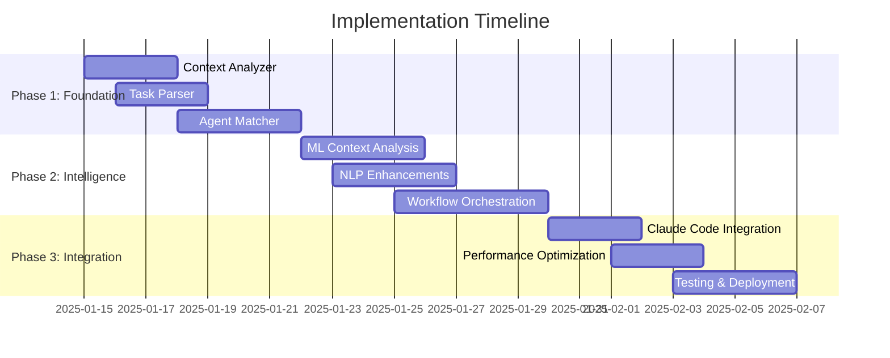

# FEAT-001: Implementation Plan - Intelligent Agent Orchestration Engine

## 🎯 Implementation Overview

**Feature**: FEAT-001 - Intelligent Agent Orchestration Engine
**Epic**: EPIC-001
**Implementation Timeline**: 4 weeks
**Team Size**: 2-3 developers
**Start Date**: TBD

## 🏗️ Technical Implementation Strategy

### **Implementation Phases**



## 📁 Code Structure

```
src/
├── orchestration/
│   ├── __init__.py
│   ├── core/
│   │   ├── context_analyzer.py      # Project context analysis
│   │   ├── task_parser.py          # Natural language task parsing
│   │   ├── agent_matcher.py        # Agent selection logic
│   │   └── workflow_orchestrator.py # Multi-agent coordination
│   ├── models/
│   │   ├── project_context.py      # Data models
│   │   ├── task_intent.py
│   │   ├── agent_match.py
│   │   └── workflow_plan.py
│   ├── services/
│   │   ├── nlp_service.py          # Natural language processing
│   │   ├── ml_service.py           # Machine learning models
│   │   ├── cache_service.py        # Performance caching
│   │   └── metrics_service.py      # Analytics and metrics
│   ├── integrations/
│   │   ├── claude_code.py          # Claude Code integration
│   │   ├── gpm_integration.py      # GPM system integration
│   │   └── spec_kit_integration.py # Spec-kit integration
│   └── utils/
│       ├── file_analyzer.py       # File system analysis
│       ├── pattern_detector.py    # Architecture pattern detection
│       └── performance_monitor.py # Performance monitoring
├── tests/
│   ├── unit/
│   ├── integration/
│   └── performance/
└── scripts/
    ├── setup_ml_models.py         # ML model initialization
    ├── benchmark_performance.py   # Performance benchmarking
    └── validate_accuracy.py       # Accuracy validation
```

## 🔧 Core Component Implementation

### **1. Context Analyzer Implementation**

```python
# src/orchestration/core/context_analyzer.py

import os
import json
from pathlib import Path
from typing import Dict, List, Optional
from ..models.project_context import ProjectContext
from ..utils.file_analyzer import FileAnalyzer
from ..utils.pattern_detector import PatternDetector

class ContextAnalyzer:
    """Analyzes project structure and extracts relevant context for agent selection"""

    def __init__(self):
        self.file_analyzer = FileAnalyzer()
        self.pattern_detector = PatternDetector()
        self._cache = {}

    def analyze_project(self, project_path: str) -> ProjectContext:
        """
        Main entry point for project context analysis

        Args:
            project_path: Path to the project root directory

        Returns:
            ProjectContext object with comprehensive project analysis
        """
        # Check cache first
        cache_key = f"{project_path}:{os.path.getmtime(project_path)}"
        if cache_key in self._cache:
            return self._cache[cache_key]

        # Perform analysis
        context = ProjectContext(
            project_type=self._detect_project_type(project_path),
            dependencies=self._extract_dependencies(project_path),
            file_structure=self._analyze_file_structure(project_path),
            architecture_type=self._detect_architecture(project_path),
            complexity_score=self._calculate_complexity(project_path),
            existing_patterns=self._detect_patterns(project_path),
            tech_stack=self._identify_tech_stack(project_path)
        )

        # Cache result
        self._cache[cache_key] = context
        return context

    def _detect_project_type(self, project_path: str) -> str:
        """Detect the primary project type based on key files"""
        indicators = {
            'package.json': 'nodejs',
            'requirements.txt': 'python',
            'pyproject.toml': 'python',
            'Cargo.toml': 'rust',
            'go.mod': 'golang',
            'pom.xml': 'java',
            'build.gradle': 'java',
            'Gemfile': 'ruby',
            'composer.json': 'php'
        }

        for file, project_type in indicators.items():
            if os.path.exists(os.path.join(project_path, file)):
                return project_type

        return 'generic'

    def _extract_dependencies(self, project_path: str) -> List[str]:
        """Extract project dependencies from various manifest files"""
        dependencies = []

        # Node.js dependencies
        package_json = os.path.join(project_path, 'package.json')
        if os.path.exists(package_json):
            with open(package_json, 'r') as f:
                data = json.load(f)
                deps = data.get('dependencies', {})
                dev_deps = data.get('devDependencies', {})
                dependencies.extend(list(deps.keys()) + list(dev_deps.keys()))

        # Python dependencies
        requirements_txt = os.path.join(project_path, 'requirements.txt')
        if os.path.exists(requirements_txt):
            with open(requirements_txt, 'r') as f:
                for line in f:
                    if line.strip() and not line.startswith('#'):
                        dep = line.split('==')[0].split('>=')[0].split('~=')[0].strip()
                        dependencies.append(dep)

        # Add more dependency extraction logic for other languages

        return list(set(dependencies))  # Remove duplicates

    def _analyze_file_structure(self, project_path: str) -> Dict:
        """Analyze project file structure and organization"""
        return self.file_analyzer.analyze_structure(project_path)

    def _detect_architecture(self, project_path: str) -> str:
        """Detect architectural patterns in the project"""
        return self.pattern_detector.detect_architecture_type(project_path)

    def _calculate_complexity(self, project_path: str) -> float:
        """Calculate project complexity score (0.0 - 1.0)"""
        factors = {
            'file_count': len(list(Path(project_path).rglob('*.py'))),  # Simplified
            'dependency_count': len(self._extract_dependencies(project_path)),
            'directory_depth': self._calculate_max_depth(project_path)
        }

        # Normalize and weight factors
        complexity = min(1.0, (
            min(factors['file_count'] / 1000, 1.0) * 0.4 +
            min(factors['dependency_count'] / 100, 1.0) * 0.4 +
            min(factors['directory_depth'] / 10, 1.0) * 0.2
        ))

        return complexity

    def _detect_patterns(self, project_path: str) -> List[str]:
        """Detect architectural and design patterns"""
        return self.pattern_detector.detect_patterns(project_path)

    def _identify_tech_stack(self, project_path: str) -> List[str]:
        """Identify technologies used in the project"""
        tech_stack = []

        # Add tech stack identification logic
        # This would analyze imports, dependencies, config files, etc.

        return tech_stack

    def _calculate_max_depth(self, project_path: str) -> int:
        """Calculate maximum directory depth"""
        max_depth = 0
        for root, dirs, files in os.walk(project_path):
            depth = len(Path(root).relative_to(project_path).parts)
            max_depth = max(max_depth, depth)
        return max_depth
```

### **2. Task Parser Implementation**

```python
# src/orchestration/core/task_parser.py

import re
from typing import Dict, List, Optional, Tuple
from ..models.task_intent import TaskIntent
from ..services.nlp_service import NLPService

class TaskParser:
    """Parses natural language task descriptions into structured intents"""

    def __init__(self):
        self.nlp_service = NLPService()
        self.intent_patterns = self._load_intent_patterns()
        self.entity_patterns = self._load_entity_patterns()

    def parse_task(self, user_input: str) -> TaskIntent:
        """
        Parse user input into structured task intent

        Args:
            user_input: Natural language task description

        Returns:
            TaskIntent object with parsed information
        """
        # Clean and normalize input
        normalized_input = self._normalize_input(user_input)

        # Extract intent type
        intent_type, intent_confidence = self._extract_intent(normalized_input)

        # Extract domain
        domain = self._extract_domain(normalized_input)

        # Extract complexity
        complexity = self._assess_complexity(normalized_input)

        # Extract entities
        entities = self._extract_entities(normalized_input)

        # Suggest workflow
        suggested_workflow = self._suggest_workflow(intent_type, domain, complexity)

        return TaskIntent(
            raw_input=user_input,
            intent_type=intent_type,
            domain=domain,
            complexity=complexity,
            entities=entities,
            confidence=intent_confidence,
            suggested_workflow=suggested_workflow
        )

    def _normalize_input(self, input_text: str) -> str:
        """Normalize input text for better processing"""
        # Convert to lowercase
        text = input_text.lower().strip()

        # Remove extra whitespace
        text = re.sub(r'\s+', ' ', text)

        # Expand common abbreviations
        abbreviations = {
            'api': 'application programming interface',
            'db': 'database',
            'ui': 'user interface',
            'auth': 'authentication'
        }

        for abbr, full in abbreviations.items():
            text = text.replace(abbr, full)

        return text

    def _extract_intent(self, text: str) -> Tuple[str, float]:
        """Extract primary intent from text"""
        intent_scores = {}

        for intent, patterns in self.intent_patterns.items():
            score = 0
            for pattern in patterns:
                matches = len(re.findall(pattern, text, re.IGNORECASE))
                score += matches
            intent_scores[intent] = score

        if not intent_scores or max(intent_scores.values()) == 0:
            return "unknown", 0.0

        best_intent = max(intent_scores, key=intent_scores.get)
        confidence = min(intent_scores[best_intent] / 3.0, 1.0)  # Normalize

        return best_intent, confidence

    def _extract_domain(self, text: str) -> str:
        """Extract technical domain from text"""
        domain_keywords = {
            'backend': ['backend', 'server', 'api', 'database', 'service'],
            'frontend': ['frontend', 'ui', 'user interface', 'client', 'web'],
            'mobile': ['mobile', 'ios', 'android', 'app', 'react native'],
            'devops': ['deploy', 'infrastructure', 'docker', 'kubernetes', 'ci/cd'],
            'security': ['security', 'authentication', 'authorization', 'encrypt'],
            'data': ['data', 'analytics', 'pipeline', 'etl', 'machine learning'],
            'testing': ['test', 'testing', 'quality', 'qa', 'validation']
        }

        domain_scores = {}
        for domain, keywords in domain_keywords.items():
            score = sum(1 for keyword in keywords if keyword in text)
            if score > 0:
                domain_scores[domain] = score

        return max(domain_scores, key=domain_scores.get) if domain_scores else 'general'

    def _assess_complexity(self, text: str) -> str:
        """Assess task complexity based on indicators"""
        complexity_indicators = {
            'simple': ['simple', 'basic', 'quick', 'easy', 'small'],
            'complex': ['complex', 'advanced', 'enterprise', 'scalable', 'production', 'comprehensive']
        }

        simple_score = sum(1 for indicator in complexity_indicators['simple'] if indicator in text)
        complex_score = sum(1 for indicator in complexity_indicators['complex'] if indicator in text)

        if complex_score > simple_score:
            return 'complex'
        elif simple_score > 0:
            return 'simple'
        else:
            return 'moderate'

    def _extract_entities(self, text: str) -> List[str]:
        """Extract key entities from text"""
        entities = []

        for entity_type, patterns in self.entity_patterns.items():
            for pattern in patterns:
                matches = re.findall(pattern, text, re.IGNORECASE)
                entities.extend([f"{entity_type}:{match}" for match in matches])

        return entities

    def _suggest_workflow(self, intent_type: str, domain: str, complexity: str) -> str:
        """Suggest appropriate workflow based on parsed information"""
        workflow_mapping = {
            ('implement', 'backend', 'simple'): 'simple_backend_implementation',
            ('implement', 'backend', 'complex'): 'full_backend_development',
            ('implement', 'frontend', 'simple'): 'simple_ui_implementation',
            ('implement', 'frontend', 'complex'): 'full_frontend_development',
            ('refactor', 'any', 'any'): 'code_refactoring',
            ('deploy', 'any', 'any'): 'deployment_pipeline',
            ('test', 'any', 'any'): 'testing_workflow'
        }

        # Find best match
        for (intent, dom, comp), workflow in workflow_mapping.items():
            if (intent == intent_type and
                (dom == domain or dom == 'any') and
                (comp == complexity or comp == 'any')):
                return workflow

        return 'general_development'

    def _load_intent_patterns(self) -> Dict[str, List[str]]:
        """Load intent detection patterns"""
        return {
            'implement': [
                r'\b(implement|build|create|develop|make)\b',
                r'\b(add|new)\b.*\b(feature|functionality)\b',
                r'\bset up\b'
            ],
            'refactor': [
                r'\b(refactor|improve|optimize|restructure)\b',
                r'\bmake.*better\b',
                r'\bclean up\b'
            ],
            'debug': [
                r'\b(debug|fix|resolve|solve)\b',
                r'\b(bug|issue|problem|error)\b',
                r'\bnot working\b'
            ],
            'deploy': [
                r'\b(deploy|release|publish|launch)\b',
                r'\bgo live\b',
                r'\bproduction\b'
            ],
            'test': [
                r'\b(test|testing|verify|validate)\b',
                r'\bquality assurance\b',
                r'\bqa\b'
            ]
        }

    def _load_entity_patterns(self) -> Dict[str, List[str]]:
        """Load entity extraction patterns"""
        return {
            'technology': [
                r'\b(react|vue|angular|nodejs|python|java|rust)\b',
                r'\b(docker|kubernetes|aws|gcp|azure)\b'
            ],
            'component': [
                r'\b(authentication|authorization|login|signup)\b',
                r'\b(database|api|endpoint|service)\b'
            ],
            'action': [
                r'\b(crud|create|read|update|delete)\b',
                r'\b(integrate|connect|link)\b'
            ]
        }
```

### **3. Agent Matcher Implementation**

```python
# src/orchestration/core/agent_matcher.py

from typing import List, Dict, Optional
from ..models.project_context import ProjectContext
from ..models.task_intent import TaskIntent
from ..models.agent_match import AgentMatch
from ..services.ml_service import MLService

class AgentMatcher:
    """Matches tasks to optimal agents based on capabilities and context"""

    def __init__(self):
        self.ml_service = MLService()
        self.agent_capabilities = self._load_agent_capabilities()
        self.performance_history = self._load_performance_history()

    def select_agents(
        self,
        task_intent: TaskIntent,
        project_context: ProjectContext,
        max_agents: int = 5
    ) -> List[AgentMatch]:
        """
        Select optimal agents for a given task and context

        Args:
            task_intent: Parsed task intent
            project_context: Project context analysis
            max_agents: Maximum number of agents to return

        Returns:
            List of AgentMatch objects ranked by suitability
        """
        matches = []

        for agent_id, capabilities in self.agent_capabilities.items():
            score = self._calculate_match_score(
                agent_id, capabilities, task_intent, project_context
            )

            if score > 0.3:  # Minimum threshold
                match = AgentMatch(
                    agent_id=agent_id,
                    agent_name=capabilities['name'],
                    confidence_score=score,
                    reasoning=self._generate_reasoning(agent_id, task_intent, score),
                    capabilities=capabilities['capabilities'],
                    estimated_duration=self._estimate_duration(agent_id, task_intent),
                    prerequisites=capabilities.get('prerequisites', []),
                    outputs=capabilities.get('outputs', [])
                )
                matches.append(match)

        # Sort by confidence score and return top matches
        matches.sort(key=lambda x: x.confidence_score, reverse=True)
        return matches[:max_agents]

    def _calculate_match_score(
        self,
        agent_id: str,
        capabilities: Dict,
        task_intent: TaskIntent,
        project_context: ProjectContext
    ) -> float:
        """Calculate match score for an agent"""

        # Capability match (40% weight)
        capability_score = self._score_capability_match(
            capabilities['capabilities'], task_intent
        )

        # Context compatibility (30% weight)
        context_score = self._score_context_compatibility(
            capabilities, project_context
        )

        # Historical performance (20% weight)
        performance_score = self._score_historical_performance(
            agent_id, task_intent, project_context
        )

        # Agent specialization (10% weight)
        specialization_score = self._score_specialization(
            capabilities, task_intent
        )

        total_score = (
            capability_score * 0.4 +
            context_score * 0.3 +
            performance_score * 0.2 +
            specialization_score * 0.1
        )

        return min(total_score, 1.0)

    def _score_capability_match(self, capabilities: List[str], task_intent: TaskIntent) -> float:
        """Score how well agent capabilities match task requirements"""
        if not capabilities:
            return 0.0

        # Create capability keywords from agent capabilities
        capability_keywords = set()
        for cap in capabilities:
            capability_keywords.update(cap.lower().split())

        # Create requirement keywords from task intent
        requirement_keywords = set()
        requirement_keywords.update(task_intent.raw_input.lower().split())
        requirement_keywords.add(task_intent.intent_type)
        requirement_keywords.add(task_intent.domain)
        requirement_keywords.update([entity.split(':')[1] for entity in task_intent.entities])

        # Calculate overlap
        overlap = len(capability_keywords.intersection(requirement_keywords))
        union = len(capability_keywords.union(requirement_keywords))

        return overlap / union if union > 0 else 0.0

    def _score_context_compatibility(self, capabilities: Dict, project_context: ProjectContext) -> float:
        """Score compatibility with project context"""
        compatibility_score = 0.0

        # Check technology stack compatibility
        agent_technologies = capabilities.get('technologies', [])
        project_technologies = [project_context.project_type] + project_context.tech_stack

        tech_overlap = len(set(agent_technologies).intersection(set(project_technologies)))
        if agent_technologies:
            compatibility_score += (tech_overlap / len(agent_technologies)) * 0.5

        # Check complexity compatibility
        agent_complexity = capabilities.get('complexity_level', 'moderate')
        project_complexity = project_context.complexity_score

        complexity_match = {
            'simple': project_complexity < 0.3,
            'moderate': 0.3 <= project_complexity < 0.7,
            'complex': project_complexity >= 0.7
        }

        if complexity_match.get(agent_complexity, False):
            compatibility_score += 0.3

        # Check architectural pattern compatibility
        agent_patterns = capabilities.get('architectural_patterns', [])
        project_patterns = project_context.existing_patterns

        pattern_overlap = len(set(agent_patterns).intersection(set(project_patterns)))
        if agent_patterns:
            compatibility_score += (pattern_overlap / len(agent_patterns)) * 0.2

        return min(compatibility_score, 1.0)

    def _score_historical_performance(
        self,
        agent_id: str,
        task_intent: TaskIntent,
        project_context: ProjectContext
    ) -> float:
        """Score based on historical performance data"""
        history = self.performance_history.get(agent_id, {})

        if not history:
            return 0.5  # Neutral score for new agents

        # Look for similar task performance
        similar_tasks = [
            record for record in history.get('task_history', [])
            if record['domain'] == task_intent.domain and
               record['intent_type'] == task_intent.intent_type
        ]

        if similar_tasks:
            avg_success_rate = sum(task['success_rate'] for task in similar_tasks) / len(similar_tasks)
            avg_satisfaction = sum(task['satisfaction'] for task in similar_tasks) / len(similar_tasks)
            return (avg_success_rate + avg_satisfaction) / 2

        # Fall back to general performance
        general_performance = history.get('overall_performance', {})
        return general_performance.get('success_rate', 0.5)

    def _score_specialization(self, capabilities: Dict, task_intent: TaskIntent) -> float:
        """Score agent specialization relevance"""
        specializations = capabilities.get('specializations', [])

        for spec in specializations:
            if (task_intent.domain in spec.lower() or
                task_intent.intent_type in spec.lower()):
                return 1.0

        return 0.5 if specializations else 0.0

    def _generate_reasoning(self, agent_id: str, task_intent: TaskIntent, score: float) -> str:
        """Generate human-readable reasoning for agent selection"""
        reasons = []

        # Add score-based reasoning
        if score > 0.8:
            reasons.append("Excellent match for this type of task")
        elif score > 0.6:
            reasons.append("Good fit based on capabilities and context")
        elif score > 0.4:
            reasons.append("Reasonable match with some limitations")
        else:
            reasons.append("Limited match - consider alternatives")

        # Add specific reasoning based on agent capabilities
        agent_info = self.agent_capabilities.get(agent_id, {})
        if task_intent.domain in agent_info.get('specializations', []):
            reasons.append(f"Specializes in {task_intent.domain}")

        return "; ".join(reasons)

    def _estimate_duration(self, agent_id: str, task_intent: TaskIntent) -> 'timedelta':
        """Estimate task duration for this agent"""
        from datetime import timedelta

        # Base estimates by complexity
        base_estimates = {
            'simple': timedelta(hours=2),
            'moderate': timedelta(hours=8),
            'complex': timedelta(days=3)
        }

        base_time = base_estimates[task_intent.complexity]

        # Adjust based on agent experience
        history = self.performance_history.get(agent_id, {})
        experience_factor = history.get('experience_factor', 1.0)

        return timedelta(seconds=int(base_time.total_seconds() / experience_factor))

    def _load_agent_capabilities(self) -> Dict:
        """Load agent capabilities from manifest or database"""
        # This would load from the manifest.json or a dedicated capabilities database
        # For now, return a simplified version

        return {
            '001': {
                'name': '001-strategy-product-leadership-guardian',
                'capabilities': ['product strategy', 'roadmap planning', 'team leadership'],
                'technologies': ['agile', 'lean'],
                'complexity_level': 'complex',
                'specializations': ['product management', 'strategy']
            },
            '062': {
                'name': '062-development-backend-senior-guardian',
                'capabilities': ['backend development', 'api design', 'database design'],
                'technologies': ['nodejs', 'python', 'sql'],
                'complexity_level': 'complex',
                'specializations': ['backend', 'api']
            }
            # ... more agents would be loaded here
        }

    def _load_performance_history(self) -> Dict:
        """Load historical performance data"""
        # This would load from analytics database or files
        # For now, return empty dict - will be populated over time
        return {}
```

## 📊 Testing Implementation

### **Unit Test Examples**

```python
# tests/unit/test_context_analyzer.py

import pytest
from unittest.mock import patch, mock_open
from src.orchestration.core.context_analyzer import ContextAnalyzer

class TestContextAnalyzer:
    def setup_method(self):
        self.analyzer = ContextAnalyzer()

    def test_detect_nodejs_project(self):
        """Test Node.js project detection"""
        with patch('os.path.exists') as mock_exists:
            mock_exists.return_value = True
            with patch('builtins.open', mock_open(read_data='{"name": "test"}')):
                project_type = self.analyzer._detect_project_type('/fake/path')
                assert project_type == 'nodejs'

    def test_extract_nodejs_dependencies(self):
        """Test dependency extraction from package.json"""
        package_json_content = '''
        {
            "dependencies": {"express": "^4.18.0", "lodash": "^4.17.21"},
            "devDependencies": {"jest": "^28.0.0"}
        }
        '''

        with patch('os.path.exists') as mock_exists:
            mock_exists.return_value = True
            with patch('builtins.open', mock_open(read_data=package_json_content)):
                deps = self.analyzer._extract_dependencies('/fake/path')
                expected_deps = ['express', 'lodash', 'jest']
                assert all(dep in deps for dep in expected_deps)

    def test_complexity_calculation(self):
        """Test project complexity scoring"""
        with patch.object(self.analyzer, '_extract_dependencies') as mock_deps:
            with patch.object(self.analyzer, '_calculate_max_depth') as mock_depth:
                with patch('pathlib.Path.rglob') as mock_rglob:
                    mock_deps.return_value = ['dep1', 'dep2', 'dep3']
                    mock_depth.return_value = 3
                    mock_rglob.return_value = ['file1.py', 'file2.py'] * 50  # 100 files

                    complexity = self.analyzer._calculate_complexity('/fake/path')
                    assert 0.0 <= complexity <= 1.0
                    assert complexity > 0  # Should have some complexity
```

## 🚀 Deployment Strategy

### **Development Environment Setup**
```bash
# Setup development environment using uv
uv venv .venv --python 3.13
source .venv/bin/activate
uv pip install -e ".[dev,docs,validation]"

# Initialize ML models
python scripts/setup_ml_models.py

# Run tests
pytest tests/ --cov=src/orchestration --cov-report=html

# Start development server
python -m src.orchestration.main --dev
```

### **Production Deployment**
```yaml
# docker-compose.yml for production deployment
version: '3.8'
services:
  orchestration:
    build: .
    ports:
      - "8000:8000"
    environment:
      - ENV=production
      - DATABASE_URL=postgresql://...
      - REDIS_URL=redis://...
    volumes:
      - ./models:/app/models
    depends_on:
      - postgres
      - redis

  postgres:
    image: postgres:14
    environment:
      POSTGRES_DB: orchestration
      POSTGRES_USER: postgres
      POSTGRES_PASSWORD: password

  redis:
    image: redis:7-alpine
```

## 📈 Performance Optimization

### **Caching Strategy**
- **Project Context**: Cache analysis results for 1 hour
- **Agent Capabilities**: Cache indefinitely, invalidate on updates
- **ML Model Results**: Cache for 10 minutes
- **Performance History**: Cache for 30 minutes

### **Scalability Considerations**
- Implement async processing for heavy operations
- Use connection pooling for database access
- Implement rate limiting for API endpoints
- Add horizontal scaling capabilities

## 📝 Documentation Requirements

### **API Documentation**
- OpenAPI specification for all endpoints
- Integration examples for Claude Code
- SDK documentation for external integrations

### **User Documentation**
- Getting started guide
- Advanced configuration options
- Troubleshooting guide
- Performance tuning recommendations

---

**Implementation Plan Version**: 1.0
**Last Updated**: 2025-09-11
**Owner**: Engineering Team
**Reviewers**: Architecture, Product, DevOps
