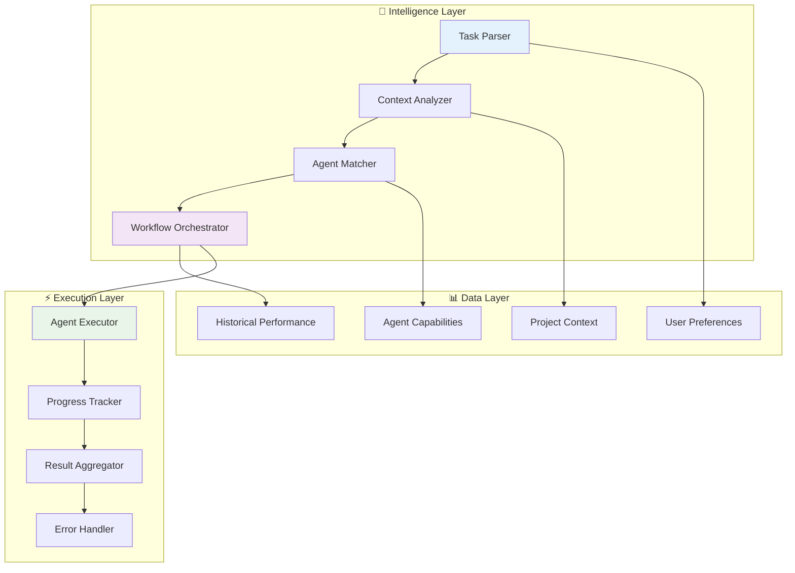

# FEAT-001: Intelligent Agent Orchestration Engine

## 🎯 Feature Overview

**Epic**: EPIC-001 - Intelligent Agent Orchestration Engine
**Priority**: P1 (Critical)
**Business Value**: Revolutionary improvement to user experience
**Effort Estimate**: 3-4 weeks
**Status**: Not Started

## 📋 Problem Statement

Current agent selection is manual and static:
- Users must know which specific agent to invoke (e.g., "use agent 062")
- No understanding of project context or task complexity
- No automatic workflow orchestration for multi-step tasks
- Cognitive load on users to understand agent capabilities

## 🎯 Solution Vision

Transform agent interaction from manual selection to intelligent orchestration:
```
BEFORE: "Use agent 062 for backend development"
AFTER:  "I need to implement user authentication" → AI automatically orchestrates
        strategy → architecture → backend → security → testing agents
```

## ✅ Success Criteria

### **Functional Requirements**
- [ ] **F1**: System analyzes project context (package.json, file structure, etc.)
- [ ] **F2**: Natural language task parsing with 90% accuracy
- [ ] **F3**: Intelligent agent selection based on context + task + capabilities
- [ ] **F4**: Automatic multi-agent workflow orchestration
- [ ] **F5**: Real-time progress tracking across agent chains
- [ ] **F6**: Graceful fallback to manual selection when automation fails

### **Non-Functional Requirements**
- [ ] **NF1**: Agent selection response time < 500ms (95th percentile)
- [ ] **NF2**: Support for 100+ concurrent orchestrations
- [ ] **NF3**: 99.9% uptime for orchestration service
- [ ] **NF4**: Comprehensive audit logging for all decisions
- [ ] **NF5**: Backward compatibility with existing manual agent selection

### **Business Success Metrics**
- [ ] **BS1**: 50% reduction in average task completion time
- [ ] **BS2**: 90% user adoption rate within 30 days
- [ ] **BS3**: 4.5/5 user satisfaction score
- [ ] **BS4**: 30% increase in complex task success rate

## 🏗️ Technical Architecture

### **System Components**



### **Core Algorithms**

#### **1. Context Analysis Algorithm**
```python
def analyze_project_context(project_path: str) -> ProjectContext:
    """
    Analyzes project structure and extracts relevant context

    Returns:
        ProjectContext with:
        - project_type: "nodejs", "python", "rust", etc.
        - dependencies: List of detected dependencies
        - architecture: "monolith", "microservices", etc.
        - patterns: Detected architectural patterns
        - complexity: "simple", "moderate", "complex"
    """
    pass
```

#### **2. Agent Selection Algorithm**
```python
def select_optimal_agents(
    task_description: str,
    project_context: ProjectContext,
    user_preferences: UserPreferences
) -> List[AgentMatch]:
    """
    Selects optimal agents for a given task

    Scoring based on:
    - Agent capability match to task requirements (40%)
    - Project context compatibility (30%)
    - Historical performance (20%)
    - User preferences (10%)
    """
    pass
```

#### **3. Workflow Orchestration Algorithm**
```python
def orchestrate_workflow(
    agents: List[AgentMatch],
    task_context: TaskContext
) -> WorkflowPlan:
    """
    Creates optimal execution plan for multi-agent workflows

    Considers:
    - Agent dependencies and prerequisites
    - Parallel execution opportunities
    - Error handling and rollback strategies
    - Progress checkpoints and validation gates
    """
    pass
```

## 🗂️ Data Models

### **ProjectContext**
```python
@dataclass
class ProjectContext:
    project_type: str           # "nodejs", "python", "rust", etc.
    dependencies: List[str]     # Detected dependencies
    file_structure: Dict        # Analyzed file organization
    architecture_type: str      # "monolith", "microservices", etc.
    complexity_score: float     # 0.0 - 1.0
    existing_patterns: List[str] # Detected patterns
    tech_stack: List[str]       # Technologies in use
    team_size: Optional[int]    # If detectable
    last_analysis: datetime     # Cache timestamp
```

### **TaskIntent**
```python
@dataclass
class TaskIntent:
    raw_input: str              # Original user input
    intent_type: str            # "implement", "refactor", "debug", etc.
    domain: str                 # "backend", "frontend", "devops", etc.
    complexity: str             # "simple", "moderate", "complex"
    entities: List[str]         # Extracted entities (auth, API, etc.)
    confidence: float           # Parser confidence 0.0 - 1.0
    suggested_workflow: str     # Recommended workflow type
```

### **AgentMatch**
```python
@dataclass
class AgentMatch:
    agent_id: str               # e.g., "062"
    agent_name: str             # Full agent name
    confidence_score: float     # Match confidence 0.0 - 1.0
    reasoning: str              # Why this agent was selected
    capabilities: List[str]     # Relevant capabilities
    estimated_duration: timedelta
    prerequisites: List[str]    # Required inputs/conditions
    outputs: List[str]          # Expected outputs
```

## 🧪 Test Strategy

### **Unit Tests**
1. **Context Analyzer Tests**
   - Test project type detection accuracy
   - Test dependency extraction
   - Test file structure analysis
   - Test edge cases (empty projects, invalid structures)

2. **Task Parser Tests**
   - Test intent classification accuracy
   - Test entity extraction
   - Test confidence scoring
   - Test multilingual support

3. **Agent Matcher Tests**
   - Test scoring algorithm accuracy
   - Test capability matching logic
   - Test performance characteristics
   - Test fallback scenarios

### **Integration Tests**
1. **End-to-End Workflow Tests**
   - Test complete user journey from task input to completion
   - Test multi-agent orchestration
   - Test error handling and recovery
   - Test performance under load

2. **Real Project Tests**
   - Test with actual open-source projects
   - Validate context analysis accuracy
   - Measure agent selection effectiveness
   - Compare against manual selection baseline

### **Performance Tests**
1. **Load Testing**
   - 100+ concurrent orchestrations
   - Memory usage under load
   - Response time degradation curves

2. **Scalability Testing**
   - Performance with large project codebases
   - Agent selection time with 100+ agents
   - Workflow orchestration complexity limits

## 📊 Validation & Acceptance

### **Alpha Release Criteria**
- [ ] Core context analysis working for Node.js and Python projects
- [ ] Basic task parsing for common development intents
- [ ] Single agent selection with >80% accuracy
- [ ] Basic error handling and fallback mechanisms
- [ ] Unit test coverage >80%

### **Beta Release Criteria**
- [ ] Multi-agent workflow orchestration functional
- [ ] Support for 5+ project types
- [ ] Advanced task parsing with entity extraction
- [ ] Real-time progress tracking
- [ ] Integration tests passing
- [ ] Performance benchmarks met

### **Production Release Criteria**
- [ ] All success criteria met
- [ ] Security review passed
- [ ] Documentation complete
- [ ] User acceptance testing >4.0/5 rating
- [ ] Production deployment validated

## 🗓️ Implementation Timeline

### **Phase 1: Foundation (Week 1-2)**
- [ ] Project context analyzer implementation
- [ ] Basic task parsing and intent classification
- [ ] Agent capability database and matching
- [ ] Core orchestration framework

### **Phase 2: Intelligence (Week 2-3)**
- [ ] Advanced context analysis with ML models
- [ ] Natural language processing enhancements
- [ ] Multi-agent workflow planning
- [ ] Historical performance integration

### **Phase 3: Integration (Week 3-4)**
- [ ] Claude Code integration and testing
- [ ] Performance optimization and caching
- [ ] Comprehensive error handling
- [ ] Production deployment preparation

## 🚨 Risks & Mitigation

### **Technical Risks**
1. **Context Analysis Complexity**
   - Risk: Accurate project analysis may be computationally expensive
   - Mitigation: Implement caching, incremental analysis, and optimization

2. **Agent Selection Accuracy**
   - Risk: Poor agent selection leads to user frustration
   - Mitigation: A/B testing, feedback loops, and manual override options

3. **Orchestration Complexity**
   - Risk: Multi-agent workflows become unpredictable
   - Mitigation: Comprehensive testing, rollback mechanisms, monitoring

### **Business Risks**
1. **User Adoption**
   - Risk: Users prefer manual agent selection
   - Mitigation: Gradual rollout, extensive user feedback, training materials

2. **Performance Impact**
   - Risk: Intelligent selection adds unacceptable latency
   - Mitigation: Aggressive optimization, caching strategies, async processing

## 📝 Dependencies

### **Technical Dependencies**
- [ ] GPM system must be fully functional and validated
- [ ] Agent metadata must include comprehensive capability descriptions
- [ ] Claude Code integration API must be stable
- [ ] Project file system access permissions

### **Resource Dependencies**
- [ ] Senior developer with AI/ML experience
- [ ] UX researcher for user testing
- [ ] DevOps engineer for deployment infrastructure
- [ ] Product manager for requirements validation

## 📈 Success Measurement

### **Technical Metrics**
- Agent selection accuracy (target: >90%)
- Task completion time reduction (target: >50%)
- System response time (target: <500ms)
- Error rate (target: <1%)

### **Business Metrics**
- User adoption rate (target: >90% in 30 days)
- User satisfaction (target: >4.5/5)
- Task success rate (target: >95%)
- Support ticket reduction (target: >40%)

### **User Experience Metrics**
- Time to first successful task completion
- Number of manual overrides needed
- User retention after 7 days
- Net Promoter Score improvement

---

**Document Version**: 1.0
**Last Updated**: 2025-09-11
**Owner**: Product Team
**Reviewers**: Engineering, UX, Product Management
